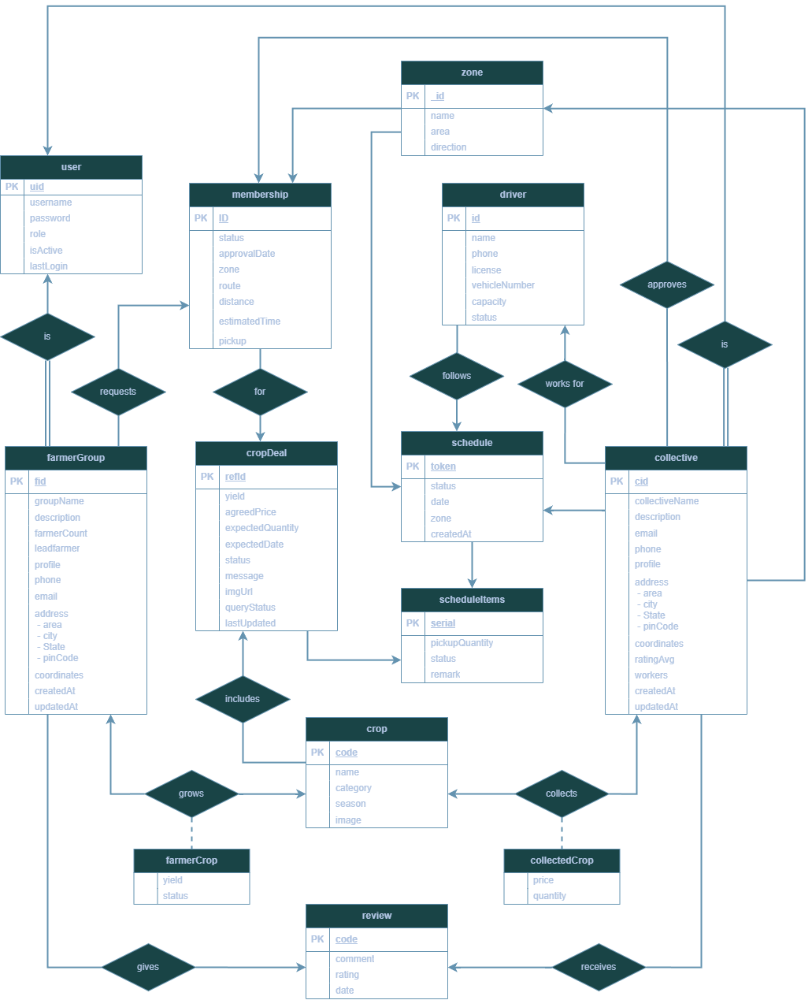
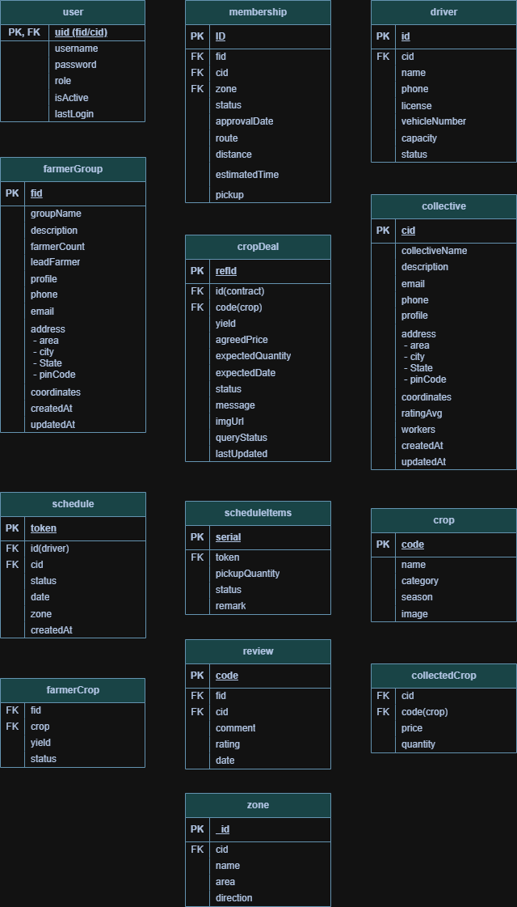

# Farm Fresh Platform

Farm Fresh is an application designed to connect organic farmer groups with collectives, streamlining logistics, crop scheduling, and platform operations.

## Database Setup

**Database Choice:** MongoDB (via Mongoose ODM)
**Why:** MongoDB is an excellent choice for this platform due to its flexible document schema. Our data models (such as Farmer Groups and Collectives) contain varying nested properties (like zones, address structures, and crops) which align perfectly with MongoDB's JSON-like document structure. Mongoose allows us to add necessary validation and type-casting while maintaining flexibility.

### Set up the database

1. Ensure you have Node.js and MongoDB installed locally, or use a MongoDB Atlas cluster.
2. Navigate to the `Backend/` directory.
3. Rename `.env.example` to `.env` and fill in your connection URI:
   ```bash
   MONGO_URI=mongodb+srv://<username>:<password>@cluster.mongodb.net/FarmFresh
   ```
4. Run the seed script to populate initial data:
   ```bash
   node src/seed.js
   ```

## Schema Diagram

Below is the Entity Relationship diagram showing our data models, fields, and relationships.



<Br/>
<Br/>
<Br/>


