<div align="center">

# 🌾 Farm Fresh Platform

**The digital marketplace connecting organic farmer groups directly with agricultural collectives & bulk buyers.**

_One transparent supply chain - no middlemen, no food waste, fair pay for every harvest._

</div>

<div align="center">


</div>

<div align="center">

### 🔗 Quick Links

**[🚀 Live Demo](https://farm-fresh-collective.vercel.app)** &nbsp;•&nbsp; **[🌍 Demo World & Test Credentials](#12--demo-world--test-credentials)**
_Demo credentials: `farmers@gmail.com` / `password` (Farmer Group) · `collective@gmail.com` / `password` (Collective)_

</div>

> [!IMPORTANT]
> This is the **single source of truth** for the Farm Fresh project. It documents the architecture, every database collection, every API endpoint, every business flow, the demo world, and how to run, extend, and deploy the platform.

---

## 📚 Table of Contents

| #   | Section                                                    | #   | Section                                                                                    |
| --- | ---------------------------------------------------------- | --- | ------------------------------------------------------------------------------------------ |
| 1   | [✨ Overview & Mission](#1--overview--mission)             | 10  | [🔐 Authentication, Authorization & Security](#10--authentication-authorization--security) |
| 2   | [🔧 Feature Tour](#2--feature-tour)                        | 11  | [📡 API Reference](#11--api-reference)                                                     |
| 3   | [🧰 Tech Stack](#3--tech-stack)                            | 12  | [🧪 Demo World & Test Credentials](#12--demo-world--test-credentials)                      |
| 4   | [🧱 System Architecture](#4--system-architecture)          | 13  | [🚀 Getting Started](#13--getting-started)                                                 |
| 5   | [📁 Repository Structure](#5--repository-structure)        | 14  | [🌐 Deployment](#14--deployment)                                                           |
| 6   | [🔩 Backend Deep Dive](#6--backend-deep-dive)              | 15  | [🧭 Roadmap & Future Work](#15--roadmap--future-work)                                      |
| 7   | [💾 Database & Data Modeling](#7--database--data-modeling) | 16  | [🧑‍💻 Development Notes & Conventions](#16--development-notes--conventions)                  |
| 8   | [🔁 Core Business Flows](#8--core-business-flows)          | 17  | [🙏 Credits & Acknowledgments](#17--credits--acknowledgments)                              |
| 9   | [💻 Frontend Deep Dive](#9--frontend-deep-dive)            |     |                                                                                            |

---

## 📸 Screenshots

> Captured from the live deployment. Log in with the drive credentials in [section 12](#12--demo-world--test-credentials) to explore the full demo world.

| | |
|---|---|
| **🏠 Home** - hero, role CTAs, stats, feature grid | **🧑‍🌾 Farmer Dashboard** - KPI cards, payout trend & crop-status charts |
| 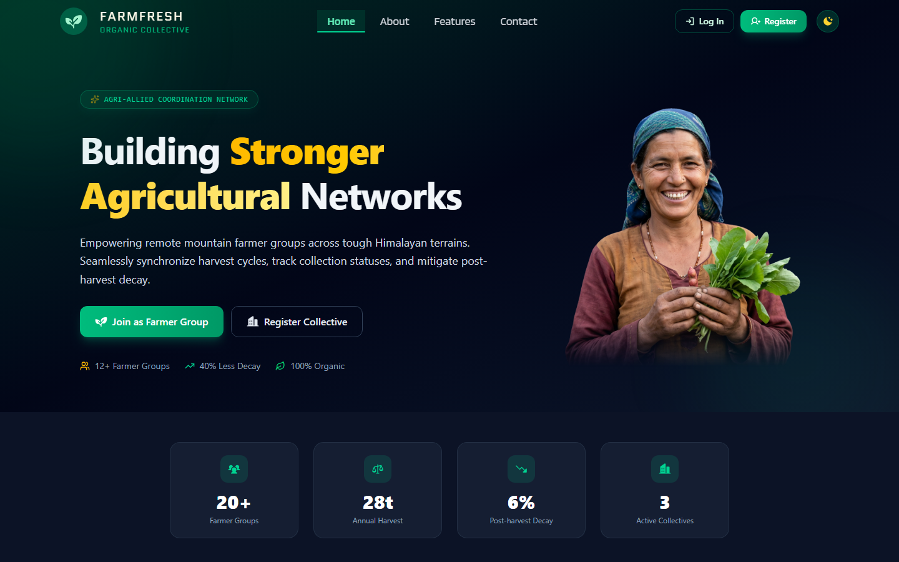 | 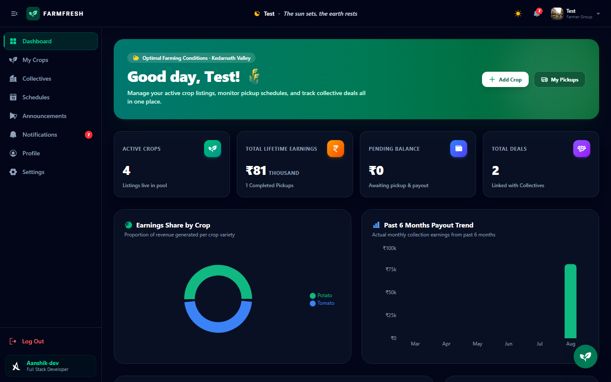 |
| **🧑‍🌾 My Crops** - growth-stage tracking & status updates | **🏭 Collective Dashboard** - KPIs, collection trend & inventory share |
| 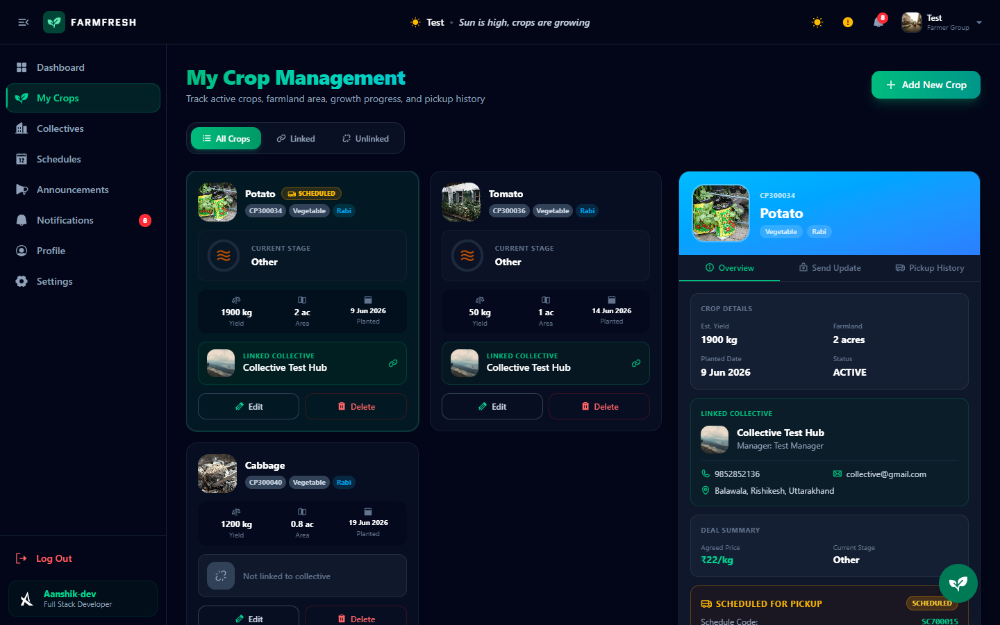 | 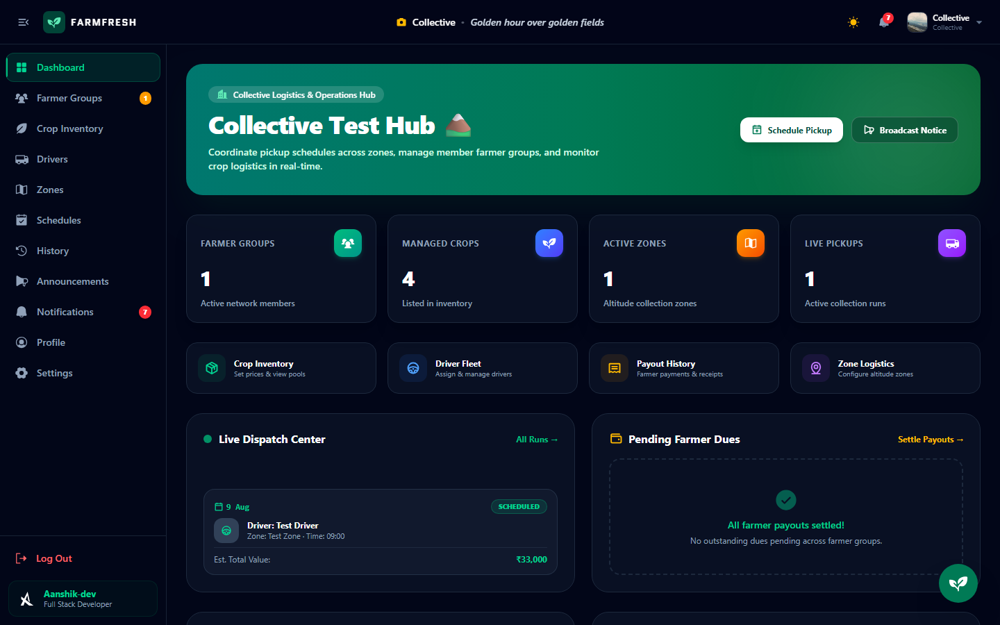 |

---

## 1. ✨ Overview & Mission

Farm Fresh is a two-sided agricultural marketplace with three distinct actors:

| 🧑‍🌾 Actor          | 🎭 Role in the platform                                                              | 🌍 Real-world counterpart                               |
| ----------------- | ------------------------------------------------------------------------------------ | ------------------------------------------------------- |
| 🧑‍🌾 `FARMER_GROUP` | Registers crops, manages growth stages, sends membership requests, receives payments | Lead farmer of an organized group of growers            |
| 🏭 `COLLECTIVE`   | Defines crop demand, zones and drivers, accepts farmers, schedules pickups, pays     | Cooperative, distributor, supermarket chain, bulk buyer |
| 🛡️ `ADMIN`        | Oversees the platform, manages users and support issues                              | Platform operator                                       |

The platform manages the **entire lifecycle** of a supply relationship - from a farmer's first membership request, through crop-by-crop deal negotiation, growth-stage tracking, physical pickup scheduling with drivers, and finally proof-backed payment settlement with a full financial ledger.

### 🎯 Why it exists

- Traditional supply chains are opaque: middlemen capture margin, farmers get squeezed, and buyers can't verify quality or origin. 😔
- Post-harvest losses are enormous because farmers plant without knowing what the market wants. 🌱
- Collectives struggle to find reliable organic suppliers who meet seasonal demand and quality metrics. 📉

### 💡 How Farm Fresh solves it

- Farmers **list anticipated yields and harvest dates** per crop; collectives **publish what they will buy and at what price**. 📊
- Relationships are formalized as **crop-level deals** (`CropDeal`) inside a **membership** - a collective can approve a farmer's apples while rejecting their oranges. 🍎
- The **pickup engine** turns "crop is READY" into a scheduled, driver-assigned, zone-scoped collection run with quantity corrections at the truck. 🚚
- The **payment engine** settles every completed run with mandatory proof of payment, per-farmer ledgers, and an immutable audit trail. 💰
- The **FarmAssist AI advisor** gives farmers crop, pest, soil, and weather guidance in simple steps. 🤖

### 🌟 Platform values

- **Transparency** - every deal, pickup, and payment is timestamped, history-tracked, and visible to both sides. 🔍
- **Fair trade** - farmers set demanded prices; collectives respond with agreed prices; balances accrue and settle promptly. ⚖️
- **Food-waste reduction** - supply matches demand at the crop level, and readiness is tracked through harvest. 🍃
- **Trust** - OTP-verified accounts, Google SSO, RBAC guards, and proof-of-payment financial records. 🛡️

[⬆️ Back to top](#-table-of-contents)

---

## 2. 🔧 Feature Tour

Everything the platform currently does, split by actor.

<details>
<summary>🧑‍🌾 <strong>Farmer Group features</strong></summary>

- **Account & profile** - OTP email verification, Google SSO, profile completion with address and map-picked coordinates, photo upload, password change, deactivation. 📧
- **Crop management** - add/edit/delete the crops you cultivate (chosen from a 110+ crop master catalog), with yield, farmland size, planted date, and growth stage (SOWING → GROWING → MATURE → READY → HARVESTED). 🌱
- **Collective browsing** - search collectives with live crop demand, prices, zones, distance sorting, and reviews; view details and send membership requests per crop. 🔎
- **Membership & deals** - request membership with specific crops, cancel pending requests, terminate active deals; every request is dealt with at crop level. 🤝
- **Growth reporting** - post stage updates with photos and messages; answer collectives' status queries (10-day cooldown between queries). 📸
- **Pickups** - see live/upcoming/past pickup runs with your crops, quantities, collected amounts, and receipts. 🚚
- **Balance & earnings** - per-collective balances, total earnings, last 50 payment receipts, 6-month payout trend chart. 💰
- **Reviews** - rate and review collectives you have worked with (one review per collective). ⭐
- **Notifications & announcements** - typed notification feed (requests, status updates, pickups, payments) and announcement board from your collectives. 🔔
- **FarmAssist AI** - chat with the built-in AI advisor from a floating widget. 🤖

</details>

<details>
<summary>🏭 <strong>Collective features</strong></summary>

- **Account & profile** - same identity tooling as farmers (OTP, Google SSO, profile, deactivation). 📧
- **Crop inventory** - publish the crops you buy (`CollectedCrop`) with quantity required and your price; edit or delete with automatic cascading (deleting a crop rejects pending deals and terminates approved ones). 📦
- **Membership management** - review incoming farmer requests, **accept per crop** (bulk-approve chosen deals with agreed price + zone, bulk-reject the rest), reject whole requests, terminate memberships, assign members to zones. 🤝
- **Zones** - create color-coded delivery zones, assign members, and scope schedules by zone. 🗺️
- **Drivers** - manage a driver fleet: name, phone, license, vehicle, capacity, photo, status lifecycle (AVAILABLE → ASSIGNED → ONROUTE → INACTIVE). 🚛
- **Pickup scheduling** - build a schedule from READY deals within a zone, pick date/time/driver/items, start/postpone/cancel/complete runs, apply quantity corrections at collection time. 📅
- **Payments** - pay farmers per schedule with mandatory proof upload (UPI / bank transfer / cash / cheque / other), mark items paid, view payment dashboards, and pull per-farmer ledgers. 💳
- **Announcements** - publish announcements (optionally targeted at crops, with new-price notices) that appear in every member farmer's feed with read tracking. 📣
- **Notifications** - typed feed for requests, status updates, pickups, and payments. 🔔
- **Dashboard** - KPIs (crops, zones, drivers, members, pickups), 6-month collection trend, inventory share charts, pending payout visibility. 📊
- **FarmAssist AI** - same floating AI widget. 🤖

</details>

<details>
<summary>🛡️ <strong>Admin features</strong></summary>

- **Platform stats** - total farmers, collectives, crops, deals, pickups, and a 12-month harvest chart. 📈
- **User management** - directory of all users with roles; activate/suspend accounts (admins can't be deactivated). 👥
- **Farmer group & collective directories** - aggregated views with zones, memberships, ratings, and harvest metrics. 🗂️
- **Issue resolution** - triage support issues (payment disputes, operational problems, data fixes) with priorities and assign-to-self / mark-resolved workflow. 🧾

> [!NOTE]
> The admin frontend currently renders from static demo data (`utils/InterfaceData.jsx`); the backend admin API is fully implemented and ready to be wired in.

</details>

<details>
<summary>🌐 <strong>Platform-wide features</strong></summary>

- **Human-readable IDs everywhere** - collectives (`FC100000`), farmer groups (`FG200000`), crops (`CP300000`), drivers (`DR600000`), schedules (`SC700000`), payments (`PM1000000`). 🔢
- **In-app notification system** - every meaningful event generates a notification with deep-link metadata and unread badges (polled every 10 s in the app shell). 🔔
- **Dark/light theme** - persisted, animated toggle, dark mode by default. 🌙
- **Fully responsive** - mobile icon rail, collapsible sidebar, glassmorphic menus; built for farmers in the field and managers at desks. 📱
- **AI assistance** - FarmAssist chatbot for both business roles. 🤖
- **Geolocation** - map-picked coordinates on profiles and Haversine-distance-sorted collective discovery. 📍

</details>

[⬆️ Back to top](#-table-of-contents)

---

## 3. 🧰 Tech Stack

<details>
<summary>🖥️ <strong>Frontend stack</strong></summary>

| Layer     | Choice                                                                         | Why                                                                                      |
| --------- | ------------------------------------------------------------------------------ | ---------------------------------------------------------------------------------------- |
| Framework | ⚛️ **React 19** + **Vite 8**                                                   | Ultra-fast HMR in dev; Rollup-based production builds keep bundles small for rural users |
| Styling   | 🎨 **Tailwind CSS v4** (CSS-first config, `@tailwindcss/vite`)                 | Utility-first, dead-CSS elimination, class-based dark mode                               |
| Routing   | 🧭 **react-router-dom 7**                                                      | Role-scoped dashboards with route guards                                                 |
| HTTP      | 🔌 **Axios** (two instances, interceptors)                                     | Automatic Bearer attachment + refresh-queue token renewal                                |
| State     | 🧠 React **Context API** + local state                                         | AuthContext, ThemeContext, ToastContext - no Redux/Zustand                               |
| Charts    | 📊 **Recharts 3**                                                              | Pie, bar, and line charts on dashboards                                                  |
| Maps      | 🗺️ **Leaflet + react-leaflet 5**                                               | Coordinate picking in profile forms                                                      |
| Icons     | 🏷️ **Iconify** (`@iconify/react`, Phosphor set)                                | Tree-shaken icon components                                                              |
| Animation | 🎬 **Framer Motion**                                                           | Page reveals, toasts, drawer transitions                                                 |
| Markdown  | 📝 **react-markdown**                                                          | Renders FarmAssist AI answers                                                            |
| UI kit    | 🧩 **None** - hand-rolled design system                                        | Button, Input, Modal, Toast, Loader, StatusBadge, StatCard, etc.                         |
| Fonts     | 🔤 ~12 Google Fonts (Inter, Baloo 2, Quantico, Blinker, Righteous, Russo One…) | Brand personality per component                                                          |

</details>

<details>
<summary>⚙️ <strong>Backend stack</strong></summary>

| Layer         | Choice                                                    | Why                                                                                   |
| ------------- | --------------------------------------------------------- | ------------------------------------------------------------------------------------- |
| Runtime       | 🟢 **Node.js** (ES Modules throughout)                    | Async, event-driven I/O for high concurrency                                          |
| Framework     | 🚂 **Express 5**                                          | Minimal REST framework; Express 5 auto-forwards rejected promises to error middleware |
| ODM           | 🍃 **Mongoose 9**                                         | Schemas, pre-save hooks, population, and multi-document transactions                  |
| Validation    | ✅ **Zod 4**                                              | Schema-first validation middleware on request bodies                                  |
| Auth          | 🔑 **jsonwebtoken** (access + refresh)                    | Stateless JWT sessions                                                                |
| OAuth         | 🔐 **passport + passport-google-oauth20**                 | Google SSO with automatic account creation                                            |
| Passwords     | 🧂 **bcryptjs**                                           | Salted hashing (passwords stored with `select: false`)                                |
| Email         | 📧 **Nodemailer** (Gmail SMTP)                            | OTP verification emails with HTML templates                                           |
| Media         | 🖼️ **multer** (memory) + **cloudinary** + **streamifier** | Buffer → stream uploads to Cloudinary                                                 |
| AI            | 🤖 **groq-sdk** (`llama-3.1-8b-instant`)                  | FarmAssist chat advisor                                                               |
| Rate limiting | 🛑 **express-rate-limit**                                 | Sliding-window limits on sensitive auth routes                                        |
| CORS          | 🌐 **cors**                                               | Whitelisted origins (FRONTEND_URL + localhost:5173)                                   |
| Dev           | 🔄 **nodemon**                                            | Auto-restart in development                                                           |

</details>

<details>
<summary>🔑 <strong>Environment variables</strong></summary>

**Backend** (`Backend/.env`, template in `Backend/.env.example`):

| Variable                                                         | Purpose                                                                       |
| ---------------------------------------------------------------- | ----------------------------------------------------------------------------- |
| `PORT`                                                           | Server port (default `6000`)                                                  |
| `FRONTEND_URL`                                                   | Allowed CORS origin (falls back to `http://localhost:5173`)                   |
| `ADMIN_MAIL` / `ADMIN_PASSWORD`                                  | Seeded admin credentials                                                      |
| `JWT_SECRET` / `JWT_REFRESH_SECRET`                              | Access and refresh token signing secrets                                      |
| `MONGODB_URI`                                                    | MongoDB Atlas connection string                                               |
| `GMAIL_USER` / `GMAIL_APP_PASS`                                  | Nodemailer Gmail sender                                                       |
| `CLOUDINARY_CLOUD_NAME` / `CLOUDINARY_KEY` / `CLOUDINARY_SECRET` | Cloudinary credentials                                                        |
| `GOOGLE_CLIENT_ID` / `GOOGLE_CLIENT_SECRET` / `GOOGLE_CALLBACK`  | Google OAuth (callback like `http://localhost:6000/api/auth/google/callback`) |
| `GROQ_API_KEY`                                                   | Groq key for FarmAssist                                                       |

**Frontend** (`Frontend/.env`, template in `Frontend/.env.example`):

| Variable           | Purpose                                                                                            |
| ------------------ | -------------------------------------------------------------------------------------------------- |
| `VITE_BACKEND_URL` | Backend base URL (e.g. `http://localhost:6000`) - the frontend talks to it directly (no dev proxy) |

</details>

[⬆️ Back to top](#-table-of-contents)

---

## 4. 🧱 System Architecture

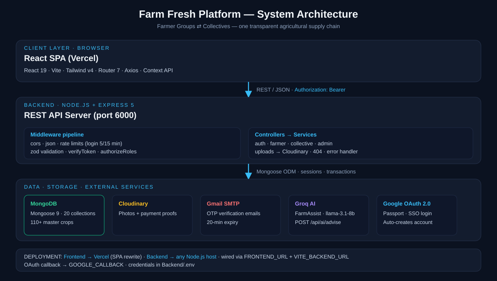

<details>
<summary>🔗 <strong>How the pieces talk to each other</strong></summary>

- The **React SPA** calls the **Express API** over HTTPS with `Authorization: Bearer <accessToken>` headers, attached automatically by an Axios request interceptor. 🔌
- The API is a classic **controller → service → model** stack. Controllers are thin; services hold business rules and run **Mongoose multi-document transactions**; models are the only place data shapes are defined. 🧱
- The frontend never touches MongoDB. All persistence goes through the API. 🗄️
- External services (Cloudinary, Gmail, Groq, Google) are only ever called by the **backend** - never from the browser. 🔒
- The two halves are wired together with `VITE_BACKEND_URL` (frontend) and `FRONTEND_URL` (backend CORS + OAuth redirect target). 🔩

</details>

<details>
<summary>🔄 <strong>Request lifecycle (end to end)</strong></summary>

1. User interacts with a page (e.g., "Send membership request"). 🖱️
2. The page calls a service module (`src/services/*.js`) → Axios instance → request interceptor stamps the JWT. 📨
3. The backend receives it: CORS check → JSON parse → rate limiter (on auth routes) → route middleware (`verifyToken`, `authorizeRoles`) → Zod validation. 🛂
4. The controller extracts parameters and delegates to a service. 🎛️
5. The service runs business logic, possibly inside a **session-backed transaction** (create/update multiple documents atomically), then returns data. 🧮
6. The controller shapes the JSON response. 📦
7. If anything throws, the **central error handler** maps it to a consistent `{ success, message, ... }` error body. 🚨
8. The Axios **response interceptor** handles 401s by queueing the request, refreshing the token, and replaying it - invisibly to the user. 🔁

</details>

<details>
<summary>☁️ <strong>Deployment model</strong></summary>

- **Frontend** → Vercel (or any static host). `vercel.json` contains an SPA rewrite (`/(.*)` → `/index.html`) so deep links like `/dashboard/farmer/overview` work. 🚀
- **Backend** → any Node.js host (Render, Railway, AWS EC2, etc.). It boots, seeds idempotently, then listens on `PORT` (default 6000). 🖥️
- **Database** → MongoDB Atlas (works on the free M0 tier thanks to the standalone-transaction shim; see the database section). 🍃
- Set `FRONTEND_URL` on the backend and `VITE_BACKEND_URL` on the frontend build to point at each other. 🔩

</details>

[⬆️ Back to top](#-table-of-contents)

---

## 5. 📁 Repository Structure

<details>
<summary>📂 <strong>Root layout</strong></summary>

```
FarmFresh/
├── Backend/            # ⚙️ Express 5 REST API (Node.js, ES Modules)
├── Frontend/           # 🖥️ React 19 + Vite 8 SPA
├── Resources/          # 🗂️ Diagrams, schema exports (ER diagrams, SVGs used in this README)
├── PROMPTS.md          # 📝 Prompting/development notes
├── responsive.md       # 📱 Responsive design notes
└── README.md           # ← 📖 you are here (single source of truth)
```

</details>

<details>
<summary>⚙️ <strong>Backend tree</strong></summary>

```
Backend/
├── .env / .env.example
├── package.json            # scripts: start, dev, seed:world, seed:world:reset
└── src/
    ├── index.js            # 🚀 entry point - boot, middleware, routes, error handler
    ├── config/             # 🔧 cloudinary, dbConnect, idConfig, mail, passport
    ├── controllers/        # 🎛️ admin, ai, auth, collective(+Extra), common, farmer(+Extra), user
    ├── middlewares/        # 🛂 authMiddleware, rateLimiter, roleMiddleware, uploader, validate
    ├── models/             # 🗄️ 20 Mongoose models (see Database section)
    ├── routes/             # 🛣️ admin, ai, auth, collective, common, farmerGroup, user
    ├── scripts/            # 🌱 seedAdmin, seedCounters, seedData, seedIssues, seedWorld
    ├── services/
    │   ├── auth/           # 🔐 login, otp, refresh, register
    │   ├── collective/     # 🏭 crop, deal, driver, membership, schedule, zone
    │   ├── farmer/         # 🧑‍🌾 crop, deal, membership, pickup, review
    │   ├── announcement.service.js   # 📣
    │   ├── dashboard.service.js      # 📊
    │   ├── email.service.js          # 📧
    │   ├── general.service.js        # 🧩
    │   ├── idGenerator.service.js    # 🔢
    │   └── notification.service.js   # 🔔
    ├── templates/          # 📄 forgotPassword.html, verifyEmail.html
    ├── utils/              # 🧰 haversine, otpGenerate, templateEngine, throwErr, uploadFile, uploadImage
    └── validations/        # ✅ auth, crop, user (Zod schemas)
```

</details>

<details>
<summary>🖥️ <strong>Frontend tree</strong></summary>

```
Frontend/
├── .env / .env.example     # 🔑 VITE_BACKEND_URL
├── index.html
├── vercel.json             # ☁️ SPA rewrite for Vercel
├── vite.config.js          # ⚡ React + Tailwind v4 plugins
├── eslint.config.js        # 📏 flat config (React Hooks, React Refresh)
└── src/
    ├── main.jsx            # ⚛️ StrictMode + <App/>
    ├── App.jsx             # 🛣️ providers + full route table + route guards
    ├── index.css           # 🎨 Tailwind v4 CSS-first config, fonts, utilities
    ├── components/
    │   ├── Navbar.jsx, Footer.jsx, FarmAssist.jsx   # 🤖 FarmAssist = AI chat widget
    │   ├── layout/AppShell.jsx          # 🧩 header, sidebar, mobile rail, badge polling
    │   ├── ui/                          # 🧩 Button, Input, Modal, Loader, Toast, AuthButtons, HeroActions
    │   └── common/                      # 🧩 CropSelect, DatePicker, MapModal, StatusBadge,
    │                                    #    StatCard, ConfirmModal, SlidePanel, ProgressWizard…
    ├── context/            # 🧠 AuthContext, ThemeContext
    ├── pages/
    │   ├── Home, About, Features, Contacts, Login, Register, AdminLogin, OAuthCallback
    │   ├── common/         # UserProfile, SettingsPage
    │   ├── farmer/         # Dashboard, CropManagement, CollectiveBrowse, Schedules,
    │   │                   # Notifications, Announcements
    │   ├── collective/     # Dashboard, FarmerGroupManagement, CropInventory, DriverManagement,
    │   │                   # ZoneManagement, PickupScheduler, CollectionHistory, Announcements, Notifications
    │   └── admin/          # Dashboard, UserManagement, FarmerGroupAdmin, CollectiveAdmin, IssueResolution
    ├── services/           # 🔌 axios.js (refresh queue), api.js (grouped endpoints),
    │                       #    auth/user/common/ai services
    └── utils/              # ⏱️ time.js, InterfaceData.jsx (static demo data)
```

</details>

[⬆️ Back to top](#-table-of-contents)

---

## 6. 🔩 Backend Deep Dive

<details>
<summary>🚀 <strong>Boot sequence (src/index.js)</strong></summary>

On every start the server runs, in order:

1. `dbConnect()` - connects to MongoDB; exits on failure; installs the **standalone-transaction shim** (see Database section). 🍃
2. `seedCounters()` - ensures a Counter document exists for every ID type. 🔢
3. `seedCrops()` - seeds the master crop catalog (110+ crops) if empty. 🌱
4. `seedAdmin()` - creates the admin user (`AD101`) from `ADMIN_MAIL`/`ADMIN_PASSWORD`. 🛡️
5. `seedIssues()` - seeds 4 sample support issues if empty. 🧾
6. `seedWorld()` - idempotently seeds the demo world (see Demo World section). 🌍
7. Builds the Express app: CORS → `express.json()` → `passport.initialize()` → routes → 404 handler → error handler. 🧱
8. Listens on `PORT` (default 6000). 🎧

All seeders are idempotent - safe to run on every boot. ✅

</details>

<details>
<summary>🧱 <strong>Middleware pipeline</strong></summary>

| #   | Middleware                 | Responsibility                                                                                                               |
| --- | -------------------------- | ---------------------------------------------------------------------------------------------------------------------------- |
| 1   | 🌐 `cors`                  | Allow `FRONTEND_URL` + `http://localhost:5173`, methods GET/POST/PATCH/DELETE, credentials                                   |
| 2   | 📦 `express.json()`        | Body parsing                                                                                                                 |
| 3   | 🔐 `passport.initialize()` | Google OAuth strategy                                                                                                        |
| 4   | 🛣️ Route handlers          | Per-route: `rateLimiter` (auth only), `validate(zodSchema)`, `verifyToken`, `authorizeRoles(...)`, `singleFile(...)` uploads |
| 5   | ❌ 404 catch-all           | `{ message: "Route not found" }`                                                                                             |
| 6   | 🚨 Global error handler    | Maps `ZodError` → 400, Mongoose `CastError` → 400 "Invalid ID format", otherwise `err.statusCode \|\| 500`                   |

</details>

<details>
<summary>🎯 <strong>Controllers vs Services (single responsibility)</strong></summary>

- **Controllers** (e.g., `collective.controller.js`) are thin: they read `req.params`/`req.body`/`req.file`, call exactly one service function, and format the result for `res`. 🎛️
- **Services** (e.g., `collective/schedule.service.js` at 1,511 lines) contain all business logic: validation rules, multi-document transactions, denormalized money updates, and notification fan-out. 🧮
- This split keeps route files small, makes services unit-testable in isolation, and means the HTTP layer and the domain layer can evolve independently. 🧩
- Async errors propagate naturally: any rejected promise inside a controller/service bubbles up to the central error handler (Express 5 behavior), or is explicitly raised via the `throwErr(statusCode, message)` utility. 🚨

</details>

<details>
<summary>📋 <strong>Error handling contract</strong></summary>

- `utils/throwErr.js` throws an `Error` carrying `statusCode` + `success` - services use it for expected failures (404, 403, 409, 429…). 🎯
- The central handler in `index.js` returns a consistent shape:
  - `ZodError` → `400 { success:false, message: <first issue message> }` ❌
  - `CastError` → `400 { success:false, message: "Invalid ID format for <field>" }` ❌
  - anything else → `{ success: err.success ?? false, message: err.message, statusCode: err.statusCode || 500 }` ⚠️
- The OTP service additionally attaches `unblockAt` so the frontend can show when a rate-lock expires. ⏳

</details>

<details>
<summary>🔢 <strong>Human-readable ID generation</strong></summary>

`services/idGenerator.service.js` atomically increments a `Counter` document (one per ID type) and returns prefixed IDs - the Mongo equivalent of a sequence:

| Prefix | Entity          | Start   |
| ------ | --------------- | ------- |
| `FC`   | 🏭 Collective   | 100000  |
| `FG`   | 🧑‍🌾 Farmer Group | 200000  |
| `CP`   | 🌱 Crop         | 300000  |
| `DR`   | 🚛 Driver       | 600000  |
| `SC`   | 📅 Schedule     | 700000  |
| `PM`   | 💰 Payment      | 1000000 |

(`AD101` for the admin is hard-coded.) IDs are generated inside the same transactions that create the documents, so they can never collide. 🎲

</details>

<details>
<summary>🛑 <strong>Rate limiting</strong></summary>

`middlewares/rateLimiter.js` uses `express-rate-limit` with sliding windows on the most attack-prone routes:

- `loginLimiter` - 5 attempts per 15 minutes (`/api/auth/login`). 🔒
- `registerLimiter` - 10 attempts per 15 minutes (`/api/auth/register`). 🔒

Standard `RateLimit-*` headers are sent to the client. 📡

</details>

<details>
<summary>🖼️ <strong>File uploads (multer + Cloudinary)</strong></summary>

- `middlewares/uploader.js` provides two multer instances (memory storage - buffers never touch disk):
  - `upload` - 2 MB, images only (profile photos, crop images). 🖼️
  - `docUpload` - 5 MB, images **or PDFs** (payment proofs). 📄
- `utils/uploadImage.js` and `utils/uploadFile.js` push buffers to Cloudinary via `streamifier` (`resource_type: "image"` or `"auto"`). ☁️
- `POST /api/upload` is the generic image endpoint: `{ folder, fileName }` in the body, returns `{ url, publicId }`. 📨
- Uploads land in logical folders: `Farmfresh/cropStatus`, `Farmfresh/userProfiles`, `Farmfresh/drivers`, `Farmfresh/payments` (payment proofs use `overwrite: false` to make them immutable). 🗂️

</details>

<details>
<summary>📧 <strong>Email service</strong></summary>

`services/email.service.js` builds HTML emails from `templates/verifyEmail.html` and `forgotPassword.html` (placeholders replaced by `utils/templateEngine.js`) and sends them via Nodemailer + Gmail. Emails note the 20-minute OTP expiry. ⏱️

> [!WARNING]
> Dev note: in `services/auth/otp.service.js` the actual `sendVerificationMail` call is currently commented out - OTPs are returned in the API response so local development works without SMTP credentials. **Re-enable the call for production.**

</details>

<details>
<summary>🤖 <strong>FarmAssist AI (Groq)</strong></summary>

- Endpoint: `POST /api/ai/advise` (requires a valid JWT). 🔐
- Stack: `groq-sdk` → `llama-3.1-8b-instant`, temperature 0.7, max 1024 tokens. 🧠
- A fixed **system prompt** ("FarmAssist") instructs the model to act as a farmer-focused advisor: crop recommendations, pest control, soil management, weather advice - always brief, actionable, step-based bullet points; it refuses to answer non-agricultural questions. 🚫
- The full message history (`{ messages: [...] }`) is forwarded; the reply text is returned as `{ success, message, data: { advice } }`. 💬
- 429 responses map to a friendly rate-limit message. ⏳

</details>

<details>
<summary>🔐 <strong>Google OAuth (Passport)</strong></summary>

- `GET /api/auth/google?role=FARMER_GROUP|COLLECTIVE` starts the flow; the chosen role is carried in OAuth `state`. 🚪
- The strategy (`config/passport.js`) looks up an existing user by email - with a role mismatch check - or creates a `User` + `FarmerGroup`/`Collective` in a **transaction** (generated UID, `provider: "GOOGLE"`, placeholder password). 🆕
- The callback signs an access token (30 min) and refresh token (7 days), updates `lastLogin`, and redirects to `${FRONTEND_URL}/oauth/callback?accessToken=...&refreshToken=...&user=...`, which the SPA persists and uses to land on the role dashboard. 🔁

</details>

<details>
<summary>🌱 <strong>Seeding scripts</strong></summary>

| Script            | What it does                                                                                                                                                                                          |
| ----------------- | ----------------------------------------------------------------------------------------------------------------------------------------------------------------------------------------------------- |
| `seedCounters.js` | One Counter doc per ID type at its start value 🔢                                                                                                                                                     |
| `seedData.js`     | Master crop catalog: 110+ crops across categories Grain, Pulse, Oilseed, Cash Crop, Plantation, Vegetable, Fruit, Spice, Fodder, Tuber with Indian seasons (Kharif, Rabi, Perennial…) and CP codes 🌾 |
| `seedAdmin.js`    | Admin user + profile, from env, in a transaction 🛡️                                                                                                                                                   |
| `seedIssues.js`   | 4 sample support issues (payment dispute, driver breakdown, wrong quantity, profile correction) 🧾                                                                                                    |
| `seedWorld.js`    | The living demo world - see section 12 🌍                                                                                                                                                             |

</details>

[⬆️ Back to top](#-table-of-contents)

---

## 7. 💾 Database & Data Modeling

### 🧠 Design philosophy

MongoDB (via Mongoose 9) is the storage engine, and the schema is deliberately document-based: agriculture data is deeply nested and heterogeneous (geospatial coordinates, growth histories, price snapshots), and a rigid SQL schema would demand constant migrations. Documents use **references** (not embedded arrays that grow unboundedly), denormalized **money counters** kept consistent inside transactions, and **human-readable IDs**. 🌾

The original design documents (kept as-is in `Resources/`) are:

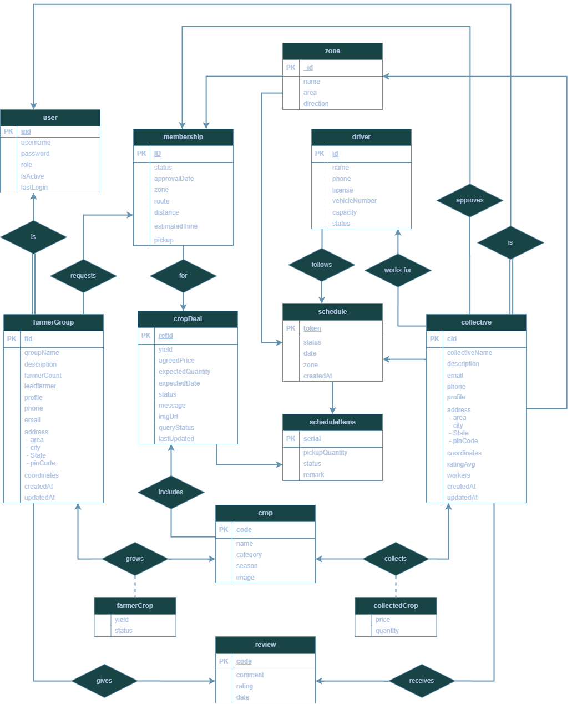
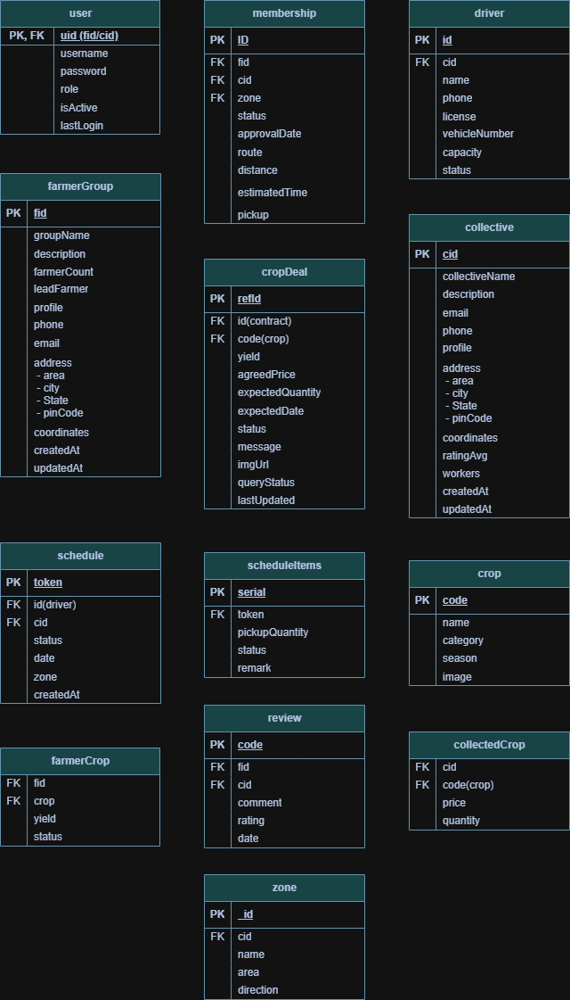

The diagrams below are the canonical, current picture:

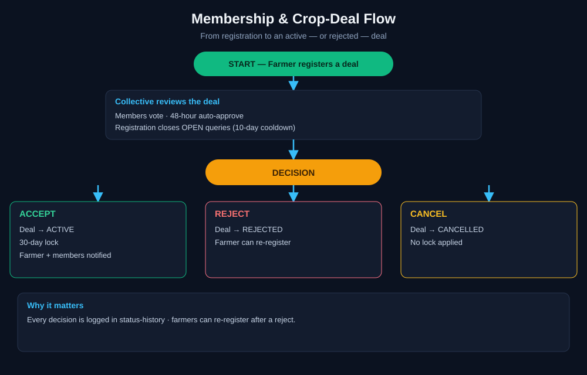
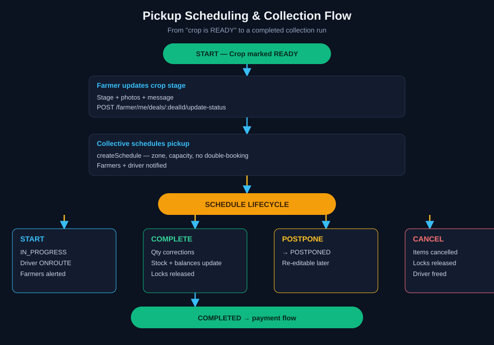
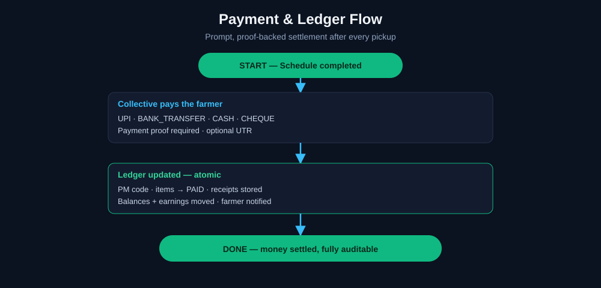

<details>
<summary>👤 <strong>Identity & user collections</strong></summary>

**User** - the auth root record.
| Field | Type | Notes |
|---|---|---|
| `uid` | String | unique, required |
| `username` | String | unique, lowercase - holds the email |
| `password` | String | required, `select:false` (bcrypt hash) |
| `role` | enum | `COLLECTIVE` · `FARMER_GROUP` · `ADMIN` |
| `provider` | enum | `LOCAL` · `GOOGLE` (default LOCAL) |
| `isActive` | Boolean | default true |
| `lastLogin` | Date | null until first login |

**Admin** - `_id` = same ObjectId as the User (1:1, `ref: "User"`).
`name` (required), `phone` (required, unique), `profile` (default ""), `desc`.

**Collective** - the buyer profile (`_id` = User's ObjectId, `auto: false`).
`name` (required, max 100), `email` (unique), `phone` (unique, sparse), `profile`, `manager` (required), `desc` (max 1000), `workers` (min 0), `address` subdoc (locality/area/town/district/state/pinCode), `coord` subdoc (`lat`, `long`), `ratingAvg` (0–5, computed from reviews).

**FarmerGroup** - the farmer profile (`_id` = User's ObjectId, `auto: false`).
`name`, `email` (unique), `phone` (unique, sparse), `profile`, `desc` (max 1000), `farmerCount` (default 1), `leadFarmer` (required), `address` subdoc, `coord` subdoc, plus **denormalized money**: `totalEarnings`, `pendingBalance`, `totalPickups` - all kept in sync inside the same transactions that complete pickups and record payments.

**PendingOTP** - one-time codes.
`email` (required), `hashOtp` (bcrypt), `attempts` (default 0), `expiry` (20 min), `blockedUntil` (6 h lock after 5 attempts), `goal` (enum `REGISTER` · `FORGOT_PASS` · `CHANGE_PASS`). Unique index `{email, goal}`; TTL index on `blockedUntil` auto-cleans stale rows.

**Counter** - ID sequence store (see ID generation).

</details>

<details>
<summary>🌾 <strong>Crops & farm operations collections</strong></summary>

**Crop** - the master, read-only catalog. No timestamps.
`code` (unique - CP300000 series), `name`, `category` (Grain, Pulse, Oilseed, Cash Crop, Plantation, Vegetable, Fruit, Spice, Fodder, Tuber), `season` (Kharif, Rabi, Perennial…), `image`.

**FarmerCrop** - a farmer's cultivated crop (unique index `{farmer, crop}`).
`farmer` (ref FarmerGroup), `crop` (ref Crop), `yield`, `farmland`, `plantedDate`, `status` (enum `ACTIVE` · `INACTIVE`). Deleting a crop cancels its REQUESTED deals and F_TERMINATEs its APPROVED deals (transactional), and refuses if the crop is locked in an open pickup.

**CollectedCrop** - a collective's demand item (unique index `{collective, crop}`).
`collective` (ref), `crop` (ref), `quantity`, `price`, `status` (enum `ACTIVE` · `INACTIVE`). Deleting cascades: reject REQUESTED deals, C_TERMINATE APPROVED deals, then soft-delete.

**Zone** - delivery zones for a collective.
`collective` (ref), `name` (max 100, duplicate names rejected), `description`, `area`, `direction`, `color` (default `#10b981`), `status` (enum `ACTIVE` · `INACTIVE`). Deleting unassigns members from the zone.

**Driver** - fleet members.
`collective` (ref), `driverId` (unique, sparse - DR600000), `profile`, `name`, `phone` (Indian mobile regex), `license`, `vehicleNumber` (uppercase), `capacity` (min 0), `zones` (refs), `totalDeliveries`, `status` (enum `AVAILABLE` · `ASSIGNED` · `ONROUTE` · `INACTIVE`).

</details>

<details>
<summary>🤝 <strong>Relationships: membership & crop deals</strong></summary>

**Membership** - the macro relationship between one farmer group and one collective.
`farmer` (ref), `collective` (ref), `zone` (ref, nullable), `route`, `distance` (km, computed with Haversine), `estTime`, `balance` (what the collective owes - the core ledger figure), `totalEarnings`, `status` (enum `PENDING` · `ACTIVE` · `REJECTED` · `INACTIVE`), `note` (max 1000), `memberSince`.

**CropDeal** - the micro unit of negotiation: one crop inside a membership.
`membership` (ref), `crop` (ref FarmerCrop), `demandedPrice`, `requestedQuantity`, `agreedPrice`, `rejectionReason`, `terminationReason`, `status` (enum `REQUESTED` · `APPROVED` · `REJECTED` · `CANCELLED` · `ABANDONED` · `F_TERMINATE` · `C_TERMINATE`), `approvalDate`.

Embedded **growth** block:
| Field | Values |
|---|---|
| `stage` | `SOWING` · `GROWING` · `MATURE` · `READY` · `HARVESTED` · `OTHER` |
| `expectedQuantity` | planned yield |
| `queryStatus` | `OPEN` · `CLOSED` (collective status queries, 10-day cooldown) |
| `lastUpdated` | Date |
| `images` | photo URLs posted by the farmer |
| `message` | farmer's update note |

Embedded **schedule** block:
| Field | Meaning |
|---|---|
| `expectedPickupDate` | set by the collective |
| `collectedQuantity` | this schedule's collected amount |
| `totalCollected` | lifetime collected amount |
| `activeSchedule` | ref to Schedule - the **double-booking lock** 🔒 |
| `lastPickupDate` / `pickupCount` | pickup history summary |
| `paymentStatus` | `PENDING` · `PARTIAL` · `PAID` |

</details>

<details>
<summary>🚚 <strong>Logistics: schedules & schedule items</strong></summary>

**Schedule** - one collection run.
`code` (unique, sparse - SC700000), `collective` (ref), `driver` (ref), `zone` (ref), `pickupDate`, `time` (default "09:00"), `status` (enum `SCHEDULED` · `IN_PROGRESS` · `COMPLETED` · `CANCELLED` · `POSTPONED`), `totalAmount`, `totalQuantity`, `paidAmount`, `farmerCount`, `itemCount`, `notes`, `startedAt`/`completedAt`/`cancelledAt`, `cancellationReason`, `postponeHistory` (array of `{from, to, reason, at}` audit entries). Indexes on `{collective, pickupDate}` and `{collective, status}`.

**ScheduleItem** - one farmer's crop line on a schedule (immutable price/crop snapshots).
`schedule` (ref), denormalized `collective`/`farmerGroup`/`membership`/`cropDeal` refs, `cropName`, `cropCode`, `plannedQuantity`, `collectedQuantity`, `agreedPrice` (copied at booking time), `totalAmount` (= qty × price), `status` (enum `PENDING` · `COLLECTED` · `SKIPPED` · `CANCELLED`), `paymentStatus` (enum `PENDING` · `PAID`), `paymentProof` (URL), `paidAt`, `paymentTransaction` (ref), `remark`. Indexed by `{schedule, farmerGroup}`, `{farmerGroup, createdAt}`, `{collective, paymentStatus}`, and `{cropDeal}`.

**PaymentTransaction** - the financial audit record.
`code` (unique, sparse - PM1000000), `collective`/`farmerGroup`/`schedule` (refs), `membership` (ref, nullable), `items` (refs to ScheduleItems), `amount`, `balanceAfter` (ledger proof), `method` (enum `UPI` · `BANK_TRANSFER` · `CASH` · `CHEQUE` · `OTHER`), `paymentProof`, `utrNumber`, `remarks`, `paymentDate`. Indexed by collective, farmerGroup, and `{schedule, farmerGroup}`.

</details>

<details>
<summary>🔔 <strong>Engagement & support collections</strong></summary>

**Notification** - the in-app event bus.
`recipient` (ref User), `recipientRole` (enum `FARMER_GROUP` · `COLLECTIVE`), `type` (enum `ANNOUNCEMENT` · `REQUEST` · `STATUS_UPDATE` · `PICKUP` · `PAYMENT` · `GENERAL`), `title` (max 200), `body` (max 1000), `data` (Mixed - deep-link metadata), `isRead`, `isDeleted` (soft delete - only read notifications may be deleted), `sender`. Indexed by `{recipient, createdAt}` and `{recipient, isRead}`.

**Announcement** - collective → farmer broadcasts.
`collective` (ref), `title` (max 200), `body` (max 2000), `targetCrops` (refs), `newPrice` (for price-change notices), `readBy` (refs - per-farmer read tracking), `status` (enum `ACTIVE` · `INACTIVE`). Creating one fans out a Notification to every member farmer group.

**Review** - farmer → collective ratings.
`fid` (ref FarmerGroup), `cid` (ref Collective), `comment` (max 1000), `rating` (1–5). Unique index `{fid, cid}` - one review per pair; resubmitting updates. Only ACTIVE partners can review; each review recomputes the collective's `ratingAvg`.

**Issue** - admin support tickets.
`title` (max 200), `description` (max 2000), `type` (enum `payment` · `operational` · `data` · `account` · `other`), `priority` (enum `low` · `medium` · `high`), `status` (enum `OPEN` · `IN_PROGRESS` · `RESOLVED`), `reportedBy`/`reportedByName`/`reportedByRole`, `assignedTo`, `resolvedAt`. Indexed by `{status, createdAt}`.

</details>

<details>
<summary>🔒 <strong>Transactions & the standalone shim</strong></summary>

Money movements, deal state changes, and schedule lifecycles are always wrapped in **Mongoose sessions** so multiple documents update atomically - e.g., accepting a membership updates several CropDeals, the Membership, and the farmer's notifications in one commit; paying a farmer updates the PaymentTransaction, ScheduleItems, Membership balance, FarmerGroup earnings, and Schedule paidAmount together. 🔐

MongoDB multi-document transactions require a replica set - which the free Atlas M0 tier and a plain local `mongod` do not provide. `config/dbConnect.js` solves this with a **standalone-compatibility shim**: after connecting, it detects a non-replica-set topology and monkey-patches Mongoose so `startSession` returns a `MockSession` whose `startTransaction`/`commitTransaction`/`withTransaction` are no-ops, and strips mock sessions from queries/aggregates/saves. The same transactional service code then runs unchanged anywhere - free Atlas, local MongoDB, or a full replica set. 🧙

</details>

<details>
<summary>⚡ <strong>Indexing strategy</strong></summary>

Hot paths are covered with compound indexes so reads stay fast as data grows:

- `User.username` unique; `FarmerGroup.email`/`Collective.email` unique; phones unique-sparse. 👤
- `FarmerCrop {farmer, crop}` and `CollectedCrop {collective, crop}` unique - one document per pair. 🌾
- `Schedule {collective, pickupDate}` and `{collective, status}` for dashboard and calendar queries. 📅
- `ScheduleItem {schedule, farmerGroup}`, `{farmerGroup, createdAt}`, `{collective, paymentStatus}`, `{cropDeal}` for pickup, ledger, and payment views. 🚚
- `PaymentTransaction {collective, createdAt}`, `{farmerGroup, createdAt}`, `{schedule, farmerGroup}`. 💰
- `Notification {recipient, createdAt}` + `{recipient, isRead}` for badge counts. 🔔
- `PendingOTP {email, goal}` unique + TTL on `blockedUntil`. ⏳
- `Review {fid, cid}` unique; `Issue {status, createdAt}`; `Announcement {collective, createdAt}`. ⭐

</details>

<details>
<summary>💰 <strong>Denormalization & money integrity</strong></summary>

Money figures appear in several places on purpose - `Membership.balance`, `FarmerGroup.pendingBalance`/`totalEarnings`/`totalPickups`, `Schedule.paidAmount`, `CropDeal.schedule.paymentStatus` - because dashboards must render without joins. Integrity is guaranteed because **every write to these fields happens inside the same transaction that creates the underlying event** (pickup completion or payment), and every `PaymentTransaction` records `balanceAfter` as ledger proof. The farmer balance page even cross-checks membership balances against line-level schedule items. 🧮

</details>

[⬆️ Back to top](#-table-of-contents)

---

## 8. 🔁 Core Business Flows

<details>
<summary>🤝 <strong>1. Membership request (farmer → collective)</strong></summary>

See the diagram above. In short: the farmer requests membership with specific crops → the system validates profile completeness and crop overlap with the collective's demand → a transaction creates/reuses the Membership (PENDING) and one `CropDeal` per crop (REQUESTED, `demandedPrice`) → the collective is notified. 📨

</details>

<details>
<summary>⚖️ <strong>2. Accept / reject / cancel (the crop-level negotiation)</strong></summary>

- **Accept** (`POST /collective/me/members/accept`): transaction that bulk-approves chosen deals (setting `agreedPrice` + `approvalDate`), bulk-rejects the rest (`rejectionReason`), flips the Membership to ACTIVE, assigns zone/route/distance/estTime, and notifies the farmer. ✅
- **Reject** (`POST /collective/me/members/reject`): transaction that rejects all REQUESTED deals and the Membership. ❌
- **Cancel** (`POST /farmer/me/members/cancel`): the farmer withdraws their own REQUESTED deals. ↩️
- **Terminate** (both roles): APPROVED-only; refused while any crop is locked in an open pickup; records `F_TERMINATE`/`C_TERMINATE`. ⛔

</details>

<details>
<summary>🌱 <strong>3. Growth tracking & status queries</strong></summary>

Farmers post stage updates (`updateCropStatus`) with photos and messages - this closes any OPEN query and notifies the collective. Collectives can request a status update (`requestCropStatus`) which opens a query with a **10-day cooldown**. Every deal keeps a full `status-history`; every deal also exposes `pickup-history` from its ScheduleItems. 📸

</details>

<details>
<summary>📅 <strong>4. Pickup scheduling & collection</strong></summary>

Covered in detail in the pickup diagram: farmer marks READY → collective creates a schedule (zone-enforced, READY-only, ≤21-day window, driver capacity, no double-booking) → transaction locks every deal into the schedule → lifecycle START / COMPLETE (with quantity corrections, stock and yield updates, balance accrual) / POSTPONE (with audit trail) / CANCEL (releasing locks). 🚚

</details>

<details>
<summary>💰 <strong>5. Payment & settlement</strong></summary>

Covered in the payment diagram: completed schedules accrue `Membership.balance` → the collective pays per schedule with a **mandatory proof upload** → one transaction creates the PaymentTransaction (PM code, `balanceAfter`), marks items PAID, moves the money on both sides, marks deals PAID/PARTIAL, and notifies the farmer. Ledger and receipt views exist for both roles. 🧾

</details>

<details>
<summary>🔔 <strong>6. Notifications & announcements</strong></summary>

All notification creation is centralized in `services/notification.service.js` (soft-delete aware, unread counts). `services/announcement.service.js` broadcasts announcements to every member farmer group with per-farmer `readBy` tracking, and supports crop-targeted and price-change announcements. The AppShell polls unread counts every 10 seconds to keep badges live. 📣

</details>

<details>
<summary>⭐ <strong>7. Reviews & ratings</strong></summary>

Only ACTIVE members can review; one review per farmer–collective pair (unique index) - resubmitting updates instead of duplicating. Every submission recomputes the collective's `ratingAvg`, which is shown on the collective directory and detail views. 🌟

</details>

[⬆️ Back to top](#-table-of-contents)

---

## 9. 💻 Frontend Deep Dive

<details>
<summary>⚛️ <strong>App bootstrap & provider stack</strong></summary>

`src/main.jsx` renders `<App/>` in StrictMode. `src/App.jsx` nests providers in order: `ThemeProvider` → `AuthProvider` → `ToastProvider` → `BrowserRouter`. The `FarmAssist` widget is mounted globally (outside `<Routes>`), and hides itself for the admin role. The router hosts a public `GuestLayout` (Navbar + Outlet + Footer) and the authenticated `AppShell`. 🧱

</details>

<details>
<summary>🛣️ <strong>Routing & route guards</strong></summary>

| Guard                  | Behavior                                                                                            |
| ---------------------- | --------------------------------------------------------------------------------------------------- |
| 🛂 `GuestRoute`        | Authenticated users are redirected to their role dashboard; used by /login, /register, /admin-login |
| 🔒 `ProtectedRoute`    | Unauthenticated → /login; wrong role → /                                                            |
| 🧭 `DashboardRedirect` | `/dashboard` index - redirects by role                                                              |

Full route table (path → component → access):

- 🌍 **Public**: `/`, `/about`, `/features`, `/contact`, `/oauth/callback`
- 🚪 **Guest-only**: `/login`, `/register`, `/admin-login`
- 🧑‍🌾 **Farmer** (`/dashboard/farmer/*`, FARMER_GROUP): `overview`, `profile`, `crops`, `collectives`, `schedules`, `notifications`, `announcements`, `settings`
- 🏭 **Collective** (`/dashboard/collective/*`, COLLECTIVE): `overview`, `profile`, `farmers`, `crops`, `drivers`, `zones`, `schedules`, `history`, `announcements`, `notifications`, `settings`
- 🛡️ **Admin** (`/dashboard/admin/*`, ADMIN): `profile`, `overview`, `users`, `farmer-groups`, `collectives`, `issues`, `settings`
- ⚠️ Fallback `*` → `/`

</details>

<details>
<summary>🧩 <strong>The AppShell (authenticated frame)</strong></summary>

`components/layout/AppShell.jsx` is the app's spine:

- **TopHeader** - collapse toggles, rotating time-of-day greeting quotes, theme toggle, notification bell with unread badge, profile dropdown with role badge and logout. 🎩
- **Sidebar** - animated collapsible (68 px ↔ 240 px) with per-link badges (unread notifications, action-needed crops, pending farmer requests); mobile overlay drawer. 📑
- **MobileIconRail** - bottom navigation with the first five links for small screens. 📱
- **Background sync** - polls notifications/crops/members APIs every 10 s to keep badge counts fresh, and listens for a `farmfresh:badges-sync` window event so pages can trigger instant refreshes. 🔄
- Renders the `ProfileBanner` (dismissible profile-completion prompt). 🪧

</details>

<details>
<summary>🎨 <strong>Design system (hand-rolled, no UI library)</strong></summary>

- `ui/` primitives: `Button` (variants, sizes, loading), `Input` (icons, errors), `Modal` (focus trap, Escape), `Loader` (spinner/skeleton/bar), `Toast` (provider + `useToast()` with typed, animated toasts), `AuthButtons`, `HeroActions`. 🧩
- `common/` building blocks: `CropSelect` (searchable master-crop picker), `CropTagInput`, `DatePicker` (custom calendar - no date library), `FilterSearchBar`, `ConfirmModal`, `EmptyState`, `MapModal` (Leaflet coordinate picker), `ImageCarouselModal`, `FormFields`, `ProfileBanner`, `PortalPageHeader`, `ProgressWizard`, `SlidePanel`, `SlideToggle`, `StatusBadge` (theme-aware pill for every status enum), `StatCard` (KPI card with trend badge). 📦
- Styling is Tailwind v4, configured **in CSS** (`index.css`): `@custom-variant dark` for class-based dark mode, ~12 imported Google Fonts with matching utility classes, custom scrollbars, focus-visible rings, and mobile tap-target sizing. 🎨

</details>

<details>
<summary>🔑 <strong>Auth state & token refresh strategy</strong></summary>

- `AuthContext` holds `user`, `isAuthenticated`, and `role`, hydrated from localStorage on mount; `login()` persists `accessToken`/`refreshToken`/`user`; `logout()` clears them; `fetchAndSyncUser()` re-syncs from `GET /user/me`. 🧠
- `services/axios.js` is the primary instance:
  - Request interceptor stamps `Authorization: Bearer <accessToken>`. ✍️
  - Response interceptor (on 401, skipping /auth/login and /auth/register): if a refresh is already in flight, the request joins a **failed-queue** and is replayed when the refresh completes; otherwise it calls `POST /auth/refresh` with the stored refresh token, swaps the access token, resolves the queue, and retries the original request. If no refresh token exists or refresh fails, storage is cleared and the user is redirected to /login. 🔁
- `services/api.js` is a secondary instance with simpler 401 handling (clear + redirect) used by a subset of pages. 🧪

</details>

<details>
<summary>🧠 <strong>State management</strong></summary>

No Redux/Zustand. `ThemeContext` (dark default, persisted, toggles the `dark` class on `<html>`), `AuthContext` (above), `ToastContext`, and per-page local state with `Promise.all`-style data fetching. Every page fetches its own data through the service modules - there is no global entity store. 🗃️

</details>

<details>
<summary>🌍 <strong>Public pages</strong></summary>

- **Home** - hero with auto-rotating image carousel, animated headline, role CTAs, stats band, 8-feature grid, role-tabbed "how it works", testimonials, FAQ, footer CTA; IntersectionObserver scroll reveals. 🏠
- **About** - story, values grid, 2019–2025 timeline, animated counters. 📖
- **Features** - showcase cards for the platform's capabilities. ✨
- **Contacts** - contact form (client-side simulation + toast), support channels, FAQ. 📬
- **Login** - split-screen, role toggle (Farmer Group / Collective), validation, inline **forgot-password panel** (email → OTP with 90 s resend countdown → new password), Google SSO button (`/api/auth/google?role=...`), `?error=oauth_failed` handling. 🔑
- **Register** - 3-step wizard (Profile → Credentials → OTP), photo upload with preview, auto-advancing 6-box OTP input with paste support and resend timer. 📝
- **AdminLogin** - dedicated admin sign-in without the public layout, hardcoded ADMIN role, its own forgot-password panel. 🛡️
- **OAuthCallback** - persists the tokens/user from the Google redirect and lands on the role dashboard. 🚪

</details>

<details>
<summary>🧑‍🌾 <strong>Farmer pages</strong></summary>

- **FarmerDashboard** - StatCards (active crops, deals, balance, upcoming pickups), 6-month payout BarChart, crop-status PieChart, recent notifications, upcoming pickups. 📊
- **CropManagement** (1,595 lines) - full CRUD over farmer crops: add/edit/delete, season & category metadata, growth-stage progress mapping (SOWING→READY), status updates incl. "Ready for Collection", photo upload via `/api/upload`, membership/deal awareness, filters, list/detail views. 🌱
- **CollectiveBrowse** - search collectives from `/api/data/collectives` (distance-sorted), detail panel with crops/prices/zones/contact/reviews, per-crop membership request/cancel, ratings. 🔎
- **FarmerSchedules** - pickup list/detail with status tabs, balance & earnings summary, payment receipt modal with proof images. 📅
- **FarmerNotifications** - typed feed with mark-read/all/delete and unread filter. 🔔
- **FarmerAnnouncements** - announcement board from all connected collectives, with read tracking and all/unread tabs. 📣

</details>

<details>
<summary>🏭 <strong>Collective pages</strong></summary>

- **CollectiveDashboard** - KPI cards, 6-month collection LineChart (₹ + kg), inventory share PieChart (quantity/revenue toggle), upcoming schedules. 📊
- **FarmerGroupManagement** (1,987 lines) - master-detail member management: deals per farmer group, accept/reject/terminate, zone assignment, per-group ledger and drill-downs (status history, pickup history, queries). 👥
- **CropInventory** - the collective's demand catalog: CRUD with prices & stock, per-crop supplying-member view. 📦
- **DriverManagement** - fleet CRUD (name, phone, license, vehicle, capacity, photo). 🚛
- **ZoneManagement** - color-coded zone CRUD. 🗺️
- **PickupScheduler** (1,225 lines) - create schedules (date/time/zone/driver/items), detail view with 8 smart metric cards, status transitions, per-item payment marking, pay-farmer flow with proof upload, payments list, ledger fetch. 📅
- **CollectionHistory** - past runs with payment-proof upload (multipart), receipts, farmer ledgers. 🗂️
- **Announcements** - create/delete announcements (crop-targeting, price notices), published list. 📣
- **CollectiveNotifications** - typed feed. 🔔

</details>

<details>
<summary>🛡️ <strong>Admin & shared pages</strong></summary>

- **AdminDashboard** - platform stat cards, 6-month harvest BarChart, open issues, recent farmer groups (currently static demo data). 📈
- **UserManagement** - user directory with role filter/search and suspend actions (static demo data). 👥
- **FarmerGroupAdmin / CollectiveAdmin** - aggregated card grids (static demo data). 🗂️
- **IssueResolution** - triage with tabs, priority badges, assign-to-self / mark-resolved (local state + toast). 🧾
- **UserProfile** (shared by all three roles) - role-aware profile editor: banners, photo upload, address + pin code, map-picked coordinates, save via `PATCH /user/me/update`. 👤
- **SettingsPage** - change password and deactivate account (ConfirmModal-guarded). ⚙️

> [!NOTE]
> Legacy, unrouted files: `farmer/FarmerProfile.jsx` and `collective/CollectiveProfile.jsx` are earlier local editors that are no longer wired into the router - the shared `UserProfile` is the live one.

</details>

<details>
<summary>📊 <strong>Charts, maps & motion</strong></summary>

- **Recharts** - Pie (crop distribution, inventory share), Bar (payout trend, monthly harvest), Line (collection trend). 📈
- **Leaflet** - only in `MapModal` for coordinate picking (markers fixed via unpkg CDN). 🗺️
- **Framer Motion** - scroll reveals, toasts, slide panels, sidebar animation. 🎬
- Tables are plain Tailwind-styled HTML - no data-grid library. 📋

</details>

<details>
<summary>📱 <strong>Responsive behavior</strong></summary>

The app targets two very different audiences: farmers on phones in the field and managers on desktops. The design responds at every breakpoint: desktop sidebar collapses to an icon rail, then to a mobile overlay drawer plus bottom icon rail; grids collapse to single column; tables scroll horizontally; the public navbar becomes a glassmorphic slide-down menu; the FarmAssist widget docks as a compact FAB. Tailwind's `sm/md/lg/xl` breakpoints and custom utilities (`no-scrollbar`, tap-target sizing, `line-clamp`) drive this - see `responsive.md` at the repo root for the design notes. 📲

</details>

[⬆️ Back to top](#-table-of-contents)

---

## 10. 🔐 Authentication, Authorization & Security

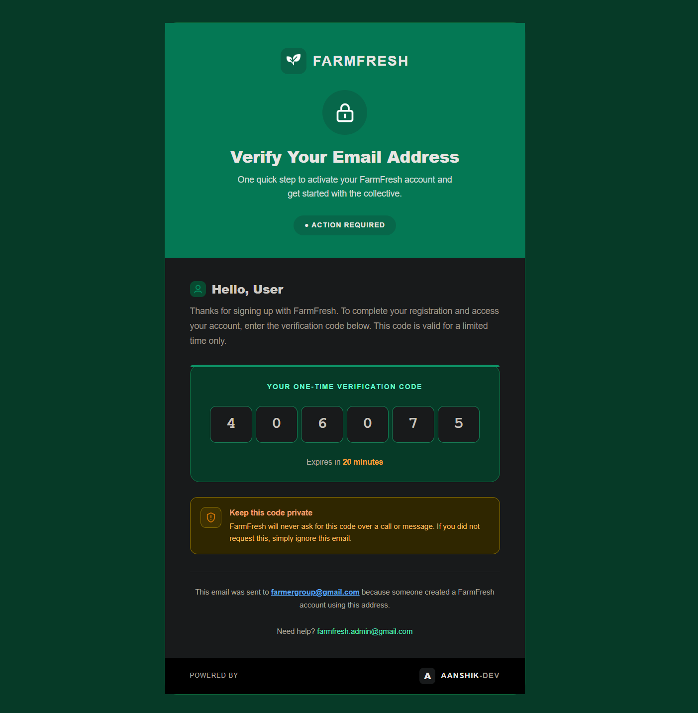

<details>
<summary>📧 <strong>OTP email verification</strong></summary>

Registration and password reset are gated by a 6-digit OTP: cryptographically random, **bcrypt-hashed** in storage, 20-minute expiry, 5 attempts then a 6-hour block (the `PendingOTP` TTL index auto-cleans old rows). Duplicate emails/phones are rejected before an OTP is even issued. OTPs are delivered via the Gmail SMTP templates; in dev the mail call is commented out and the OTP is returned in the response (re-enable for production). ⏳

</details>

<details>
<summary>🔑 <strong>JWT access & refresh tokens</strong></summary>

- Login issues an **access token (1 day)** and a **refresh token (7 days)** signed with separate secrets (`JWT_SECRET` vs `JWT_REFRESH_SECRET`). 🗝️
- Google OAuth issues a 30-minute access token + 7-day refresh token. 🔐
- The access token travels in the `Authorization: Bearer` header; the refresh token is exchanged at `POST /api/auth/refresh` (frontend queues concurrent 401s and replays them - see the frontend section). 🔁
- Passwords are bcrypt-hashed and never returned (`select: false`); `lastLogin` is stamped on every login. 🧂

</details>

<details>
<summary>🪪 <strong>Google SSO</strong></summary>

OAuth2 flow via Passport, scoped to profile + email, carrying the chosen role in `state`. Existing emails are linked (with a role mismatch check), new ones are created in a transaction with `provider: "GOOGLE"`. Google accounts cannot change passwords through the local flow (the change-password service rejects non-LOCAL providers). 🚪

</details>

<details>
<summary>🛡️ <strong>Role-based access control (RBAC)</strong></summary>

`verifyToken` (auth) + `authorizeRoles(...)` (authorization) are stacked on every protected route:

- `FARMER_GROUP` routes under `/api/farmer/*` 🧑‍🌾
- `COLLECTIVE` routes under `/api/collective/*` 🏭
- `ADMIN` routes under `/api/admin/*` 🛡️
- `/api/user/me*` allows all three roles; the AI endpoint requires any authenticated user. 👤

A farmer hitting a collective endpoint receives 403 before any business logic runs. 🚫

</details>

<details>
<summary>✅ <strong>Input validation</strong></summary>

Zod schemas (`src/validations/`) enforce request shapes before controllers run: login, register (email, password ≥ 8, role, name, 10-digit phone, 6-digit OTP, leader), crop add/edit, and profile update schemas. Malformed payloads get a 400 with the first issue message - this neutralizes NoSQL injection-style payloads and junk bodies. 🧹

</details>

<details>
<summary>🛡️ <strong>Attack mitigation summary</strong></summary>

- Brute-force / credential stuffing → rate limiters on login & register (sliding windows). 🛑
- OTP abuse → per-email attempt caps + blocks, hashed storage. ⏳
- NoSQL injection → schema validation + typed fields only. 🧱
- Cross-site OAuth → callback redirects only to `FRONTEND_URL`. 🌐
- CORS → explicit origin allow-list with credentials. 🔒
- Sensitive data → `select: false` on passwords, no secrets in the frontend (only `VITE_BACKEND_URL`). 🤫
- Financial tampering → every money mutation runs inside a transaction with `balanceAfter` ledger proofs. 💰

</details>

[⬆️ Back to top](#-table-of-contents)

---

## 11. 📡 API Reference

All endpoints live under `/api` on the backend (default `http://localhost:6000`). Protected routes require `Authorization: Bearer <accessToken>`. Roles: `FARMER_GROUP`, `COLLECTIVE`, `ADMIN`.

<details>
<summary>🔐 <strong>Auth - `/api/auth`</strong></summary>

| Method | Path               | Access                           | Description                                                              |
| ------ | ------------------ | -------------------------------- | ------------------------------------------------------------------------ |
| POST   | `/get-otp`         | Public                           | Send a REGISTER OTP (checks email/phone uniqueness first)                |
| POST   | `/forgot-otp`      | Public                           | Send a FORGOT_PASS OTP                                                   |
| POST   | `/forgot-password` | Public                           | Verify OTP and reset password                                            |
| POST   | `/register`        | Public, rate-limited (10/15 min) | Register FarmerGroup/Collective (multipart profile photo, Zod-validated) |
| POST   | `/login`           | Public, rate-limited (5/15 min)  | Login → access (1d) + refresh (7d) tokens                                |
| POST   | `/refresh`         | Public                           | Exchange refresh token for a new access token                            |
| GET    | `/google`          | Public                           | Start Google SSO (`?role=FARMER_GROUP\|COLLECTIVE`)                      |
| GET    | `/google/callback` | Public                           | OAuth callback → redirect to frontend with tokens                        |

</details>

<details>
<summary>📡 <strong>Data - `/api/data` (public)</strong></summary>

| Method | Path                           | Description                                                                                                                                       |
| ------ | ------------------------------ | ------------------------------------------------------------------------------------------------------------------------------------------------- |
| GET    | `/crops`                       | Master crop catalog 🌾                                                                                                                            |
| GET    | `/collectives?lat&long&radius` | Collective directory, Haversine-sorted when coords given, enriched with ACTIVE crops (price/qty), member farmer-group count, active zone count 📍 |

</details>

<details>
<summary>👤 <strong>User - `/api/user`</strong></summary>

| Method | Path                  | Access                   | Description                            |
| ------ | --------------------- | ------------------------ | -------------------------------------- |
| GET    | `/me`                 | All roles                | Current user + role profile merged     |
| PATCH  | `/me/update`          | All roles (multipart)    | Update profile, address, coords, photo |
| PATCH  | `/me/deactivate`      | FARMER_GROUP, COLLECTIVE | Soft-deactivate account                |
| PATCH  | `/me/change-password` | FARMER_GROUP, COLLECTIVE | Change password (LOCAL providers only) |
| GET    | `/admin`              | ADMIN                    | Greeting (placeholder)                 |

</details>

<details>
<summary>🧑‍🌾 <strong>Farmer - `/api/farmer` (FARMER_GROUP only)</strong></summary>

| Method                | Path                                                                                                                           | Description                           |
| --------------------- | ------------------------------------------------------------------------------------------------------------------------------ | ------------------------------------- |
| POST/GET/PATCH/DELETE | `/me/crops`                                                                                                                    | Manage farmer crops 🌱                |
| POST                  | `/me/members/request`                                                                                                          | Send membership request (transaction) |
| POST                  | `/me/members/cancel`                                                                                                           | Cancel own REQUESTED deals            |
| POST                  | `/me/members/terminate`                                                                                                        | Terminate active membership           |
| GET                   | `/me/members`                                                                                                                  | Memberships bucketed by deal status   |
| POST                  | `/me/deals/:dealId/update-status`                                                                                              | Post growth stage/photos/message 📸   |
| GET                   | `/me/deals/:dealId/status-history`                                                                                             | Growth history                        |
| GET                   | `/me/deals/:dealId/pickup-history`                                                                                             | Pickup ledger per deal                |
| GET                   | `/me/deals/active`                                                                                                             | Active deals                          |
| GET                   | `/me/pickups`                                                                                                                  | Pickups grouped per schedule          |
| GET                   | `/me/pickups/:scheduleId`                                                                                                      | Pickup detail with receipts           |
| GET                   | `/me/balance`                                                                                                                  | Per-collective balances + receipts 💰 |
| GET                   | `/me/notifications` · PATCH `/me/notifications/:id/read` · PATCH `/me/notifications/read-all` · DELETE `/me/notifications/:id` | Notification feed 🔔                  |
| POST/GET              | `/me/reviews`                                                                                                                  | Submit / list reviews ⭐              |
| GET                   | `/me/announcements` · PATCH `/me/announcements/:id/read`                                                                       | Announcement board 📣                 |
| GET                   | `/me/dashboard`                                                                                                                | Dashboard stats 📊                    |

</details>

<details>
<summary>🏭 <strong>Collective - `/api/collective` (COLLECTIVE only)</strong></summary>

| Method                | Path                                                             | Description                                      |
| --------------------- | ---------------------------------------------------------------- | ------------------------------------------------ |
| POST/GET/PATCH/DELETE | `/me/crops`                                                      | Crop demand inventory 📦                         |
| GET                   | `/me/members`                                                    | Members bucketed by deal status                  |
| POST                  | `/me/members/accept`                                             | Bulk-accept/reject deals + zone (transaction) ✅ |
| POST                  | `/me/members/reject`                                             | Reject request (transaction) ❌                  |
| POST                  | `/me/members/terminate`                                          | Terminate membership                             |
| PATCH                 | `/me/members/:membershipId/zone`                                 | Assign/clear zone 🗺️                             |
| POST/GET              | `/me/zones` · PATCH/DELETE `/me/zones/:zoneId`                   | Zone CRUD                                        |
| POST/GET              | `/me/drivers` · PATCH/DELETE `/me/drivers/:driverId`             | Driver CRUD (photos) 🚛                          |
| POST                  | `/me/deals/:dealId/query-status`                                 | Open a growth query (10-day cooldown)            |
| PATCH                 | `/me/deals/:dealId/pickup-date`                                  | Set expected pickup date                         |
| GET                   | `/me/deals/:dealId/status-history`                               | Growth history                                   |
| GET                   | `/me/ready-deals`                                                | READY deals not locked in a schedule             |
| GET                   | `/me/pickup-dashboard`                                           | Live/upcoming/unpaid + pending payout            |
| POST                  | `/me/schedules`                                                  | Create schedule (transaction) 📅                 |
| GET                   | `/me/schedules?filter=` · GET `/me/schedules/:scheduleId`        | List/detail                                      |
| PATCH                 | `/me/schedules/:scheduleId`                                      | Update schedule (two-phase validation)           |
| PATCH                 | `/me/schedules/:scheduleId/status`                               | START / COMPLETE / POSTPONE / CANCEL             |
| PATCH                 | `/me/schedules/:scheduleId/items/:itemId/pay`                    | Mark single item paid                            |
| POST                  | `/me/schedules/:scheduleId/farmers/:farmerGroupId/pay`           | Pay a farmer (transaction, proof required) 💳    |
| GET                   | `/me/payments?farmerGroupId&scheduleId`                          | Payment history                                  |
| POST                  | `/me/payments/proof`                                             | Upload payment proof (multipart) 📎              |
| GET                   | `/me/farmers/:farmerGroupId/ledger`                              | Farmer ledger 🧾                                 |
| GET                   | `/me/notifications` · PATCH read · PATCH read-all · DELETE       | Notification feed 🔔                             |
| POST/GET              | `/me/announcements` · DELETE `/me/announcements/:announcementId` | Announcements 📣                                 |
| GET                   | `/me/dashboard`                                                  | Dashboard stats 📊                               |

</details>

<details>
<summary>🛡️ <strong>Admin - `/api/admin` (ADMIN only)</strong></summary>

| Method | Path                 | Description                                 |
| ------ | -------------------- | ------------------------------------------- |
| GET    | `/stats`             | Platform totals + 12-month harvest chart 📈 |
| GET    | `/farmer-groups`     | Farmer groups with aggregates               |
| GET    | `/collectives`       | Collectives with aggregates                 |
| GET    | `/users`             | All users + profiles                        |
| PATCH  | `/users/:id/status`  | Activate/deactivate (never admins)          |
| GET    | `/issues`            | Support issues 🧾                           |
| PATCH  | `/issues/:id/status` | Triage: assign/resolve                      |

</details>

<details>
<summary>🤖 <strong>AI & uploads</strong></summary>

| Method | Path             | Access                 | Description                                                                  |
| ------ | ---------------- | ---------------------- | ---------------------------------------------------------------------------- |
| POST   | `/api/ai/advise` | Any authenticated user | FarmAssist chat (`{ messages: [...] }`) 🤖                                   |
| POST   | `/api/upload`    | -                      | Generic Cloudinary image upload (`{ folder, fileName }` + multipart file) 🖼️ |
| GET    | `/`              | Public                 | Health check: `{ message: "FarmFresh backend is running" }` 💚               |

</details>

[⬆️ Back to top](#-table-of-contents)

---

## 12. 🧪 Demo World & Test Credentials

<details>
<summary>🌍 <strong>The living demo world (seedWorld)</strong></summary>

`npm run seed:world` (in `Backend/`) populates the database with a realistic, fully-simulated agricultural marketplace set in the Indian Himalayan belt (Uttarakhand & Himachal Pradesh): 🏔️

- **6 collectives** - e.g. Mandakini Organic Collective, Garhwal Agri Hub, Himalayan Harvest Collective, Kumaon Fresh Collective, Devbhoomi Farmer Market, plus a test hub - each with zones, drivers (realistic Indian license/vehicle data), and crop buy-prices. 🏭
- **12 farmer groups** - e.g. Kedarnath Valley Farmers, Ukhimath Organic Group, Gopeshwar Green Collective, Almora Apple Growers, Kullu Valley Farmers, Kangra Tea & Grain Growers, Solan Vegetable Farmers, plus a test group - with realistic addresses, coordinates, farmer counts, and crops with yield/farmland/planted dates. 🧑‍🌾
- **14 scripted "stories" (A–N)** replaying real business flows over ~11 months with staggered timestamps: membership requests, partial accept/reject, growth updates with photos, status queries, scheduling → in-progress → completion with quantity corrections, payments (UPI/bank transfer with UTR numbers and receipt images), postponements, cancellations, reviews (updating `ratingAvg`), and ~11 announcements with read tracking. 🎬
- Deterministic seeded RNG; notification read-status housekeeping; staggered `lastLogin` times. 🎲
- **Idempotent**: skips if any bot email exists. `--reset` wipes the 15 world collections but **refuses to run if a real (non-bot) account exists** unless `--force` is passed. 🛑

</details>

<details>
<summary>🔑 <strong>Test credentials</strong></summary>

| 🎭 Role         | 📧 Email                                | 🔑 Password              |
| --------------- | --------------------------------------- | ------------------------ |
| 🧑‍🌾 Farmer Group | `farmers@gmail.com`                     | `password`               |
| 🏭 Collective   | `collective@gmail.com`                  | `password`               |
| 🛡️ Admin        | set via `ADMIN_MAIL` / `ADMIN_PASSWORD` | set via `ADMIN_PASSWORD` |

All 18 world accounts share the password `password`. There is also a dev helper, `Backend/check_users.js`, which prints the first 5 FARMER_GROUP users.

> [!TIP]
> After seeding, log in as `collective@gmail.com` / `password` and check the **Pickup Scheduler** - the demo stories left a full backlog of READY deals, schedules, and payments to explore.

</details>

[⬆️ Back to top](#-table-of-contents)

---

## 13. 🚀 Getting Started

<details>
<summary>✅ <strong>Prerequisites</strong></summary>

- Node.js 18+ (ES Modules) 🟢
- A MongoDB instance - Atlas (free M0 works thanks to the transaction shim) or local `mongod` 🍃
- (Optional but recommended) Cloudinary, Gmail app password, Groq, and Google OAuth credentials - without them, uploads, email, AI, and SSO degrade gracefully for development 🧪

</details>

<details>
<summary>⚙️ <strong>Backend setup</strong></summary>

1. Open a terminal in `Backend/`:
   ```bash
   npm install
   ```
2. Create the environment file:
   ```bash
   copy .env.example .env
   ```
3. Edit `.env` - minimum viable:
   ```bash
   PORT=6000
   MONGODB_URI=mongodb+srv://<user>:<pass>@cluster.mongodb.net/FarmFresh
   JWT_SECRET=long_random_string_1
   JWT_REFRESH_SECRET=long_random_string_2
   ADMIN_MAIL=admin@farmfresh.local
   ADMIN_PASSWORD=AdminPass123!
   FRONTEND_URL=http://localhost:5173
   ```
4. (Recommended) build the demo world:
   ```bash
   npm run seed:world
   ```
5. Start the server:
   ```bash
   npm run dev        # 🔄 nodemon
   # or
   npm start          # node src/index.js
   ```
   Verify: `GET http://localhost:6000/` → `{ "message": "FarmFresh backend is running" }` ✅

</details>

<details>
<summary>🖥️ <strong>Frontend setup</strong></summary>

1. Open a second terminal in `Frontend/`:
   ```bash
   npm install
   ```
2. Create the environment file and point it at the backend:
   ```bash
   copy .env.example .env
   # VITE_BACKEND_URL=http://localhost:6000
   ```
3. Start the dev server:
   ```bash
   npm run dev
   ```
4. Open `http://localhost:5173` and log in with a demo account (section 12). 🎉

Other scripts: `npm run build` (production build), `npm run preview`, `npm run lint` (ESLint flat config).

</details>

<details>
<summary>🛠️ <strong>Common troubleshooting</strong></summary>

- **CORS errors** 🌐 - ensure `FRONTEND_URL` in `Backend/.env` matches the frontend origin exactly.
- **"Invalid ID format"** ❌ - the API uses Mongo ObjectIds for refs; human-readable IDs (`FG...`, `SC...`) are display codes, not lookup keys.
- **OTP never arrives** 📧 - dev mode returns the OTP in the `/get-otp` response (email send is commented out); in production set `GMAIL_USER`/`GMAIL_APP_PASS` and uncomment the call in `services/auth/otp.service.js`.
- **Transactions not applying** 🔄 - on a standalone MongoDB the shim makes them no-ops by design; use a replica set if you need rollback semantics.
- **Login throttled** ⏳ - the login limiter (5/15 min) locks briefly; wait or restart the server to clear the in-memory store.
- **Google callback wrong port** 🚪 - `GOOGLE_CALLBACK` in `.env.example` references port 5000; align it with your actual backend port (default 6000) and the authorized redirect URI in Google Cloud Console.

</details>

[⬆️ Back to top](#-table-of-contents)

---

## 14. 🌐 Deployment

<details>
<summary>🖥️ <strong>Backend</strong></summary>

1. Set production values for every variable in `.env` (strong JWT secrets, real Gmail/Cloudinary/Groq/Google credentials, `FRONTEND_URL` = your frontend domain). 🔑
2. Run `npm install --omit=dev` and start with `npm start` (or a process manager like PM2 / a platform like Render or Railway). 🚀
3. Make sure the host allows the health check and that MongoDB Atlas network access allows the host's IP. 🌐
4. OTP emails: uncomment the `sendVerificationMail` call in `services/auth/otp.service.js`. 📧

</details>

<details>
<summary>⚡ <strong>Frontend (Vercel)</strong></summary>

1. In Vercel, import the `Frontend/` directory as the project root. 📂
2. Add the environment variable `VITE_BACKEND_URL` = your deployed backend URL. 🔑
3. The included `vercel.json` SPA rewrite makes all routes serve `index.html` (deep links like `/dashboard/farmer/overview` work on refresh). 🔗
4. Deploy - the static build is generated with `npm run build`. 🎉

</details>

[⬆️ Back to top](#-table-of-contents)

---

## 15. 🧭 Roadmap & Future Work

<details>
<summary>🚧 <strong>Planned enhancements</strong></summary>

- [ ] 🔌 **Wire the admin frontend to the live admin API** (currently static demo data)
- [ ] 🔔 **Real-time notifications** - move from 10-second polling to WebSocket/SSE push
- [ ] 💳 **Escrow & automated payments** - Stripe or UPI-automation integration with smart-contract-style settlement on delivery
- [ ] 🧠 **Deeper AI** - demand forecasting, pricing intelligence, weather + soil fusion for FarmAssist
- [ ] 🛰️ **GPS / IoT logistics tracking** - live driver tracking and ETA computation for collectives
- [ ] 📈 **Analytics suite** - seasonal supply trends, decay forecasting, per-crop profitability
- [ ] 📱 **Dedicated mobile app** - offline-first React Native app for farmers in low-connectivity areas
- [ ] 🧪 **e2e test suites** - Vitest + Playwright coverage for both apps

</details>

[⬆️ Back to top](#-table-of-contents)

---

## 16. 🧑‍💻 Development Notes & Conventions

<details>
<summary>⚙️ <strong>Backend conventions</strong></summary>

- ES Modules throughout; controllers thin, services fat, models authoritative. 📐
- Errors via `throwErr(statusCode, message)`; async handlers rely on Express 5 promise forwarding - no manual `try/catch` spaghetti. 🧹
- Every multi-document mutation is a transaction (or runs through the standalone shim). 🔐
- Money fields are denormalized deliberately - never update them outside their owning transaction. 💰
- New ID types: add a prefix in `config/idConfig.js` and a Counter entry; the generator does the rest. 🔢
- `common.controller.js` and a couple of helpers are legacy dead code - safe to remove when cleaning up. 🧹

</details>

<details>
<summary>🖥️ <strong>Frontend conventions</strong></summary>

- Relative imports only (no aliases); API calls live in `src/services/`, pages compose them. 📁
- New statuses: add a mapping to `StatusBadge` and the role sidebar in `utils/InterfaceData.jsx` (also the source of admin demo data). 🏷️
- Badge sync: after an action that changes counts, dispatch `window.dispatchEvent(new Event("farmfresh:badges-sync"))`. 🔔
- Theme: new components should respect `dark:` variants; no hard-coded light-only colors. 🌙
- Run `npm run lint` before pushing; the flat ESLint config covers React Hooks and Refresh rules. 📏

</details>

<details>
<summary>📖 <strong>Keeping this README accurate</strong></summary>

- Diagrams live in `Resources/` as SVGs - regenerate/edit them there, never inline. 🗂️
- The old schema exports (`ER-Diagram.*`, `Entity-Tables.*`) are preserved in `Resources/` for reference. 📄
- Update the API reference whenever a route changes; update the collection tables whenever a model changes. 🔄

</details>

[⬆️ Back to top](#-table-of-contents)

---

## 17. 🙏 Credits & Acknowledgments

Built as a full-stack learning-and-production project: **React + Vite + Tailwind** frontend, **Express 5 + Mongoose 9** backend, **MongoDB Atlas** storage, **Cloudinary** media, **Groq** AI, **Google OAuth**, and **Nodemailer** email. The frontend footer credits the developer portfolio at `aanshik-dev.vercel.app`. 👨‍💻

> [!TIP]
> **Navigation tip:** every topic above is inside a collapsible section so this document stays scannable - click any section header to expand it. Diagrams are referenced from `Resources/` (SVGs + the original ER diagram PNGs/PDFs).

---


<div align="center">

**Thank you for reading - happy farming!** 🌾🚜

_© Farm Fresh Platform - Built with 💚_

</div>
