<div align="center">

# 🌾 Farm Fresh Platform

**The digital marketplace connecting organic farmer groups directly with agricultural collectives & bulk buyers.**

_One transparent supply chain - no middlemen, no food waste, fair pay for every harvest._

</div>

<div align="center">


</div>

<div align="center">

### 🔗 Quick Links

**[🚀 Live Demo](https://farm-fresh-collective.vercel.app)** &nbsp;·&nbsp; **[🌍 Demo World & Test Credentials](#12--demo-world--test-credentials)**
_Demo credentials: `farmers@gmail.com` / `password` (Farmer Group) · `collective@gmail.com` / `password` (Collective)_

</div>

> [!IMPORTANT]
> This is the **single source of truth** for the Farm Fresh project. It documents the architecture, every database collection, every API endpoint, every business flow, the demo world, and how to run, extend, and deploy the platform.

---

## 📚 Table of Contents


| #   | Section                                                    | #   | Section                                                                                    |
| --- | ---------------------------------------------------------- | --- | ------------------------------------------------------------------------------------------ |
| 1   | [✨ Overview & Mission](#1--overview--mission)             | 10  | [🔐 Authentication, Authorization & Security](#10--authentication-authorization--security) |
| 2   | [🔧 Feature Tour](#2--feature-tour)                        | 11  | [📡 API Reference](#11--api-reference)                                                     |
| 3   | [🧰 Tech Stack](#3--tech-stack)                            | 12  | [🧪 Demo World & Test Credentials](#12--demo-world--test-credentials)                      |
| 4   | [🧱 System Architecture](#4--system-architecture)          | 13  | [🚀 Getting Started](#13--getting-started)                                                 |
| 5   | [📁 Repository Structure](#5--repository-structure)        | 14  | [🌐 Deployment](#14--deployment)                                                           |
| 6   | [🔩 Backend Deep Dive](#6--backend-deep-dive)              | 15  | [🧭 Roadmap & Future Work](#15--roadmap--future-work)                                      |
| 7   | [💾 Database & Data Modeling](#7--database--data-modeling) | 16  | [🧑‍💻 Development Notes & Conventions](#16--development-notes--conventions)               |
| 8   | [🔁 Core Business Flows](#8--core-business-flows)          | 17  | [🙏 Credits & Acknowledgments](#17--credits--acknowledgments)                              |
| 9   | [💻 Frontend Deep Dive](#9--frontend-deep-dive)            |     |                                                                                            |

---

## 📸 Screenshots


### 🔐 Auth & Onboarding (public pages)

| | |
|---|---|
| **🏠 Home** - hero, role CTAs, stats & feature grid | **🔑 Login** - role toggle, forgot-password & Google SSO |
|  | 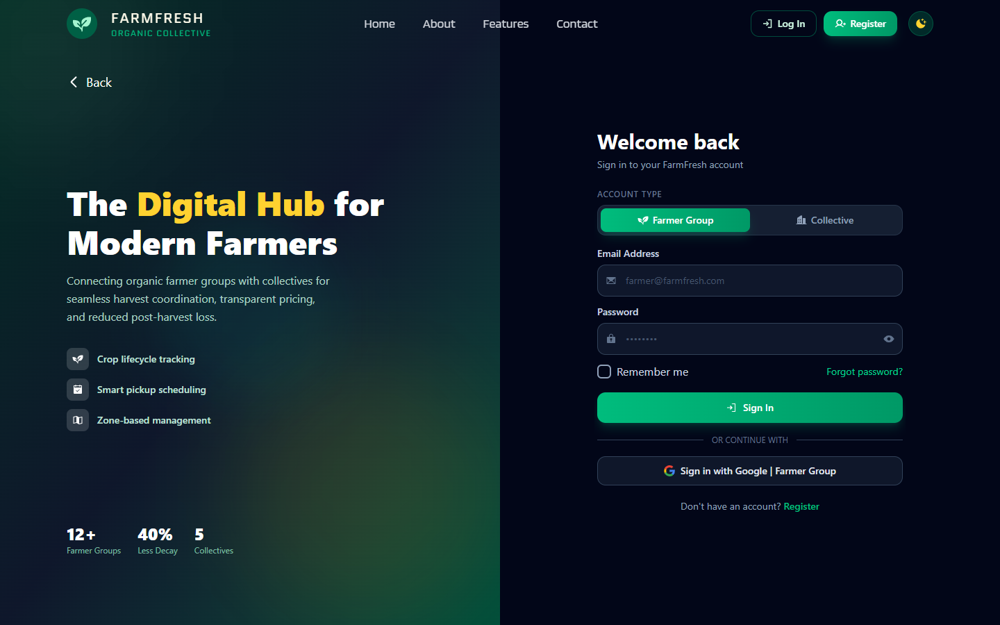 |
| **📝 Register** - 3-step wizard with OTP verification | **🛡️ Admin Login** - dedicated admin sign-in |
| 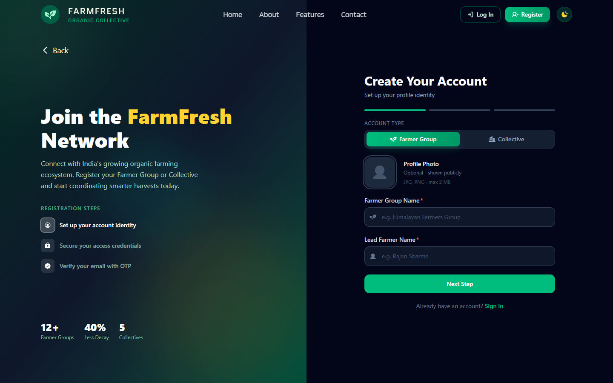 | 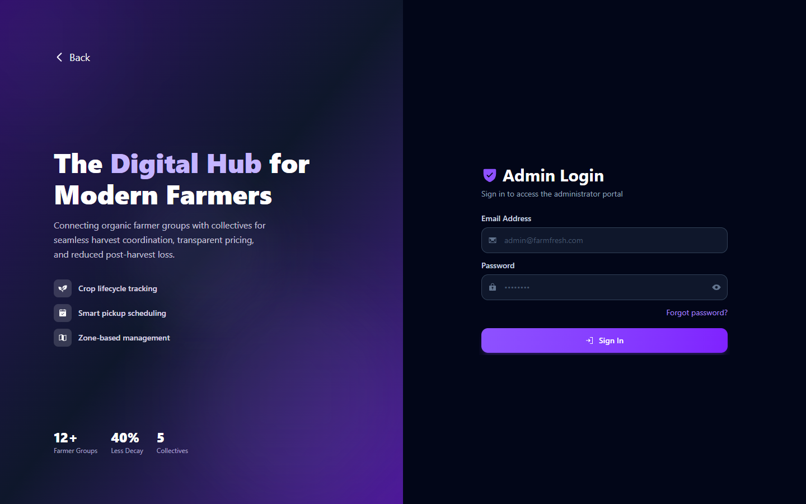 |

### 🧑‍🌾 Farmer Group Pages

| | |
|---|---|
| **📊 Farmer Dashboard** - KPIs, payout trend & crop-status charts | **🌱 My Crops** - growth-stage tracking & status updates |
|  |  |
| **🔎 Find Collectives** - demand browsing, distance-sorted | **🚚 Schedules & Payments** - pickups, receipts & balances |
| 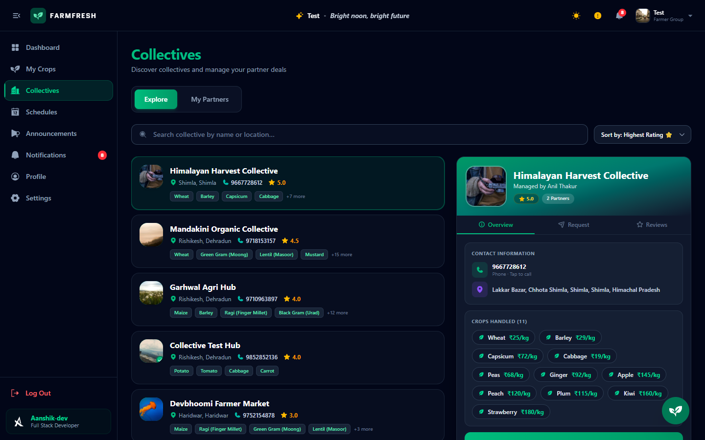 | 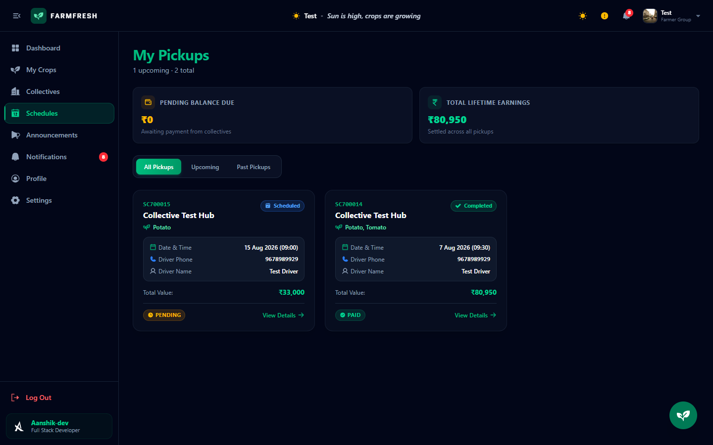 |

### 🏭 Collective Pages

| | |
|---|---|
| **📊 Collective Dashboard** - KPIs & collection trend charts | **👥 Farmer Group Management** - members, deals & ledgers |
|  | 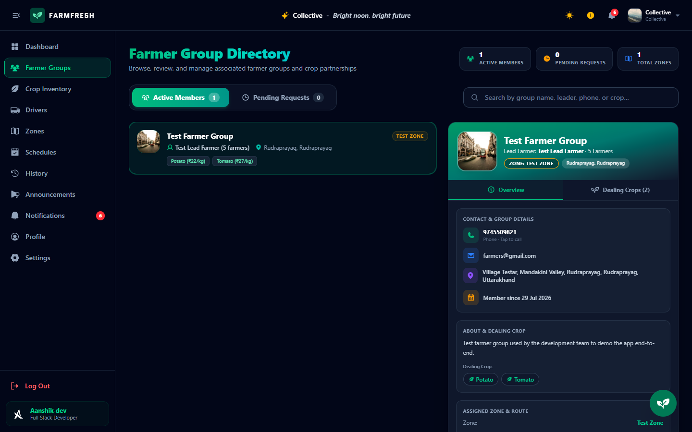 |
| **📦 Crop Inventory** - demand catalog with prices & stocks | **📅 Pickup Scheduler** - schedule builder & payment marking |
| 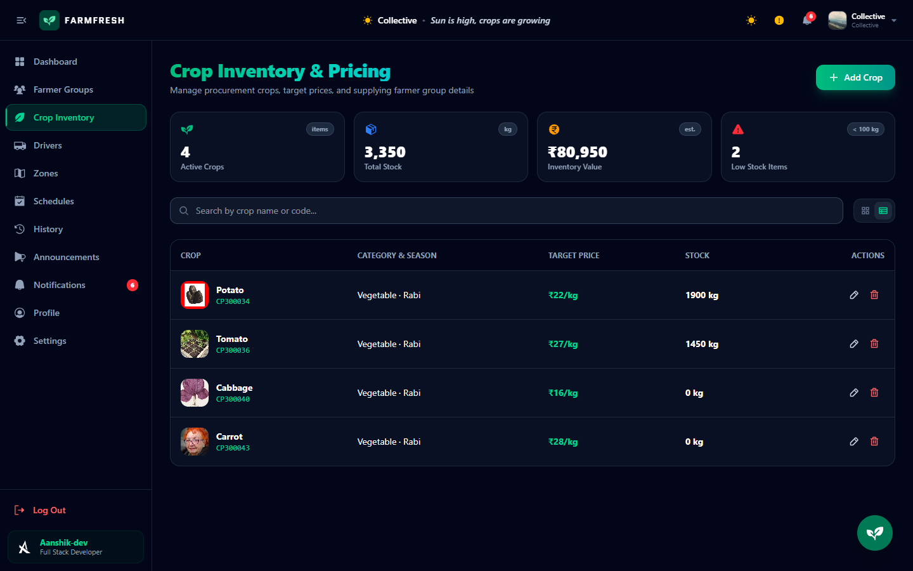 | 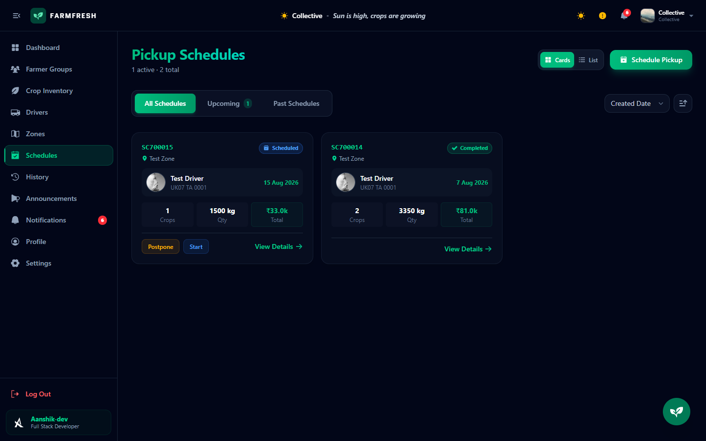 |

### 🛡️ Admin Pages

| | |
|---|---|
| **📈 Admin Dashboard** - platform stats & harvest chart | **👥 User Management** - user directory & suspensions |
| 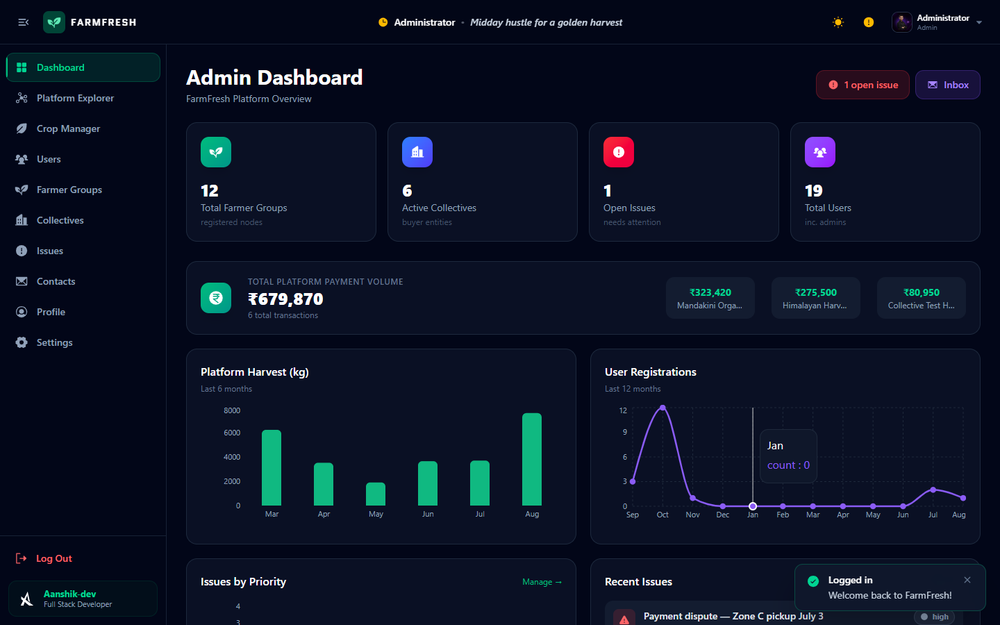 | 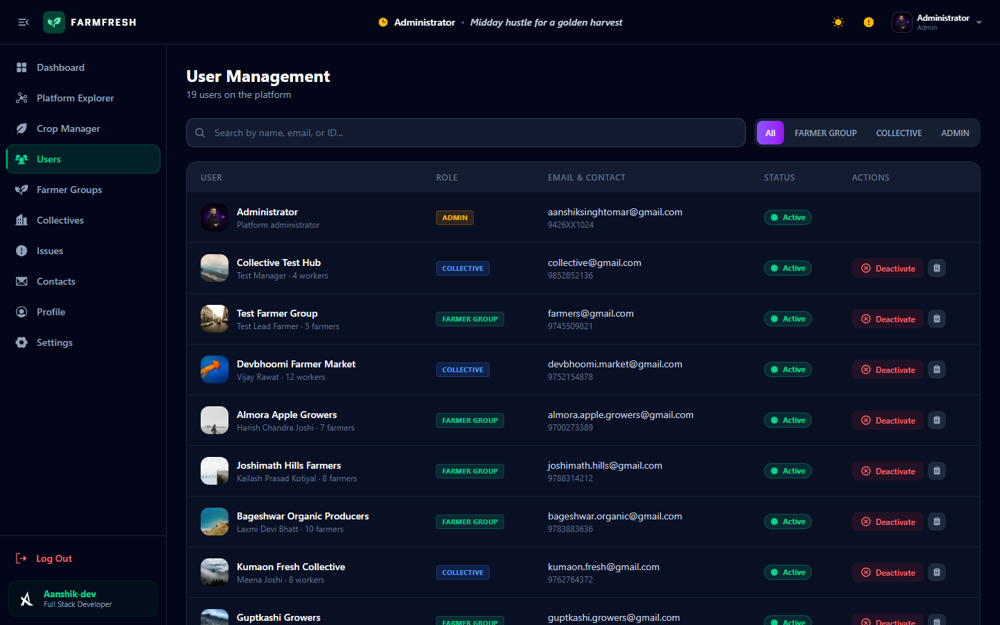 |
| **🗺️ Farmer Group Directory** - aggregated view | **🧾 Issue Resolution** - support ticket triage |
| 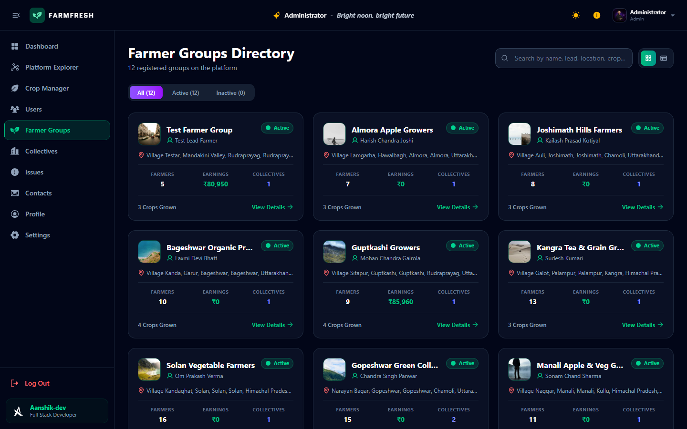 | 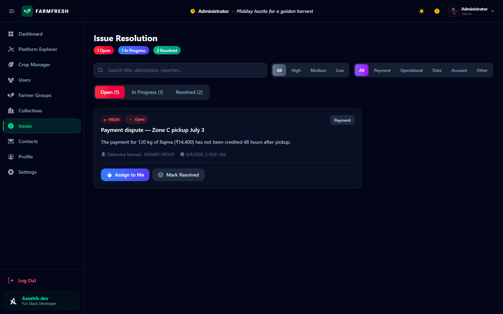 |

---

## 1. ✨ Overview & Mission

Farm Fresh is a two-sided agricultural marketplace with three distinct actors:

| 🧑‍🌾 Actor          | 🎭 Role in the platform                                                              | 🌍 Real-world counterpart                                  |
| ----------------- | ------------------------------------------------------------------------------------ | ----------------------------------------------------------- |
| 🧑‍🌾 `FARMER_GROUP` | Registers crops, manages growth stages, sends membership requests, receives payments | Lead farmer of an organized group of growers                |
| 🏭 `COLLECTIVE`   | Defines crop demand, zones and drivers, accepts farmers, schedules pickups, pays     | Cooperative, distributor, supermarket chain, bulk buyer    |
| 🛡️ `ADMIN`        | Oversees the platform, manages users, master crops and support issues               | Platform operator                                           |

The platform manages the **entire lifecycle** of a supply relationship - from a farmer's first membership request, through crop-by-crop deal negotiation, growth-stage tracking, physical pickup scheduling with drivers, and finally proof-backed payment settlement with a full financial ledger.

### 🎯 Why it exists

- Traditional supply chains are opaque: middlemen capture margin, farmers get squeezed, and buyers can't verify quality or origin. 😔
- Post-harvest losses are enormous because farmers plant without knowing what the market wants. 🌱
- Collectives struggle to find reliable organic suppliers who meet seasonal demand and quality metrics. 📉

### 💡 How Farm Fresh solves it

- Farmers **list anticipated yields and harvest dates** per crop; collectives **publish what they will buy and at what price**. 📊
- Relationships are formalized as **crop-level deals** (`CropDeal`) inside a **membership** - a collective can approve a farmer's apples while rejecting their oranges. 🍎
- The **pickup engine** turns "crop is READY" into a scheduled, driver-assigned, zone-scoped collection run with quantity corrections at the truck. 🚚
- The **payment engine** settles every completed run with mandatory proof of payment, per-farmer ledgers, and an immutable audit trail. 💰
- The **FarmAssist AI advisor** gives farmers crop, pest, soil, and weather guidance in simple, actionable steps. 🤖

### 🌟 Platform values

- **Transparency** - every deal, pickup, and payment is timestamped, history-tracked, and visible to both sides. 🔍
- **Fair trade** - farmers set demanded prices; collectives respond with agreed prices; balances accrue and settle promptly. ⚖️
- **Food-waste reduction** - supply matches demand at the crop level, and readiness is tracked through harvest. 🍃
- **Trust** - OTP-verified accounts, Google SSO, RBAC guards, and proof-of-payment financial records. 🛡️

[⬆️ Back to top](#-table-of-contents)

---

## 2. 🔧 Feature Tour

**In one line:** everything the platform currently does, split by actor. Each collapsible block below is the full checklist of one role - open the one you need.

<details>
<summary>🧑‍🌾 <strong>Farmer Group features</strong> - profile, crops, collective discovery, membership & deals, growth reporting, pickups, earnings, reviews, FarmAssist AI</summary>

- **Account & profile** - OTP email verification, Google SSO, profile completion with address and map-picked coordinates, photo upload, password change, deactivation. 📧
- **Crop management** - add/edit/delete the crops you cultivate (from a 110+ crop master catalog), with yield, farmland size, planted date, and growth stage (SOWING → GROWING → MATURE → READY → HARVESTED). 🌱
- **Collective browsing** - search collectives with live crop demand, prices, zones, distance sorting, and reviews; send membership requests per crop. 🔎
- **Membership & deals** - request membership with specific crops, cancel pending requests, terminate active deals; every request is negotiated at crop level. 🤝
- **Growth reporting** - post stage updates with photos and messages; answer collectives' status queries (10-day cooldown between queries). 📸
- **Pickups** - live/upcoming/past pickup runs with your crops, quantities, collected amounts, and receipts. 🚚
- **Balance & earnings** - per-collective balances, total earnings, last 50 payment receipts, 6-month payout trend chart. 💰
- **Reviews** - rate and review collectives you have worked with (one review per collective). ⭐
- **Notifications & announcements** - typed notification feed and announcement board from your collectives. 🔔
- **FarmAssist AI** - chat with the built-in AI advisor from a floating widget. 🤖

</details>

<details>
<summary>🏭 <strong>Collective features</strong> - crop inventory, membership management, zones & drivers, pickup scheduling, payments, announcements, dashboard</summary>

- **Crop inventory** - publish the crops you buy (`CollectedCrop`) with quantity required and your price; deleting a crop cascades (rejects pending deals, terminates approved ones). 📦
- **Membership management** - review requests, **accept per crop** (agreed price + zone), bulk-reject, terminate memberships, assign members to zones. 🤝
- **Zones & drivers** - create color-coded delivery zones; manage a driver fleet with a status lifecycle (AVAILABLE → ASSIGNED → ONROUTE → INACTIVE). 🗺️🚛
- **Pickup scheduling** - build a schedule from READY deals in a zone, pick date/time/driver/items, start/postpone/cancel/complete runs with quantity corrections at the truck. 📅
- **Payments** - pay farmers per schedule with mandatory proof upload, mark items paid, view payment dashboards, pull per-farmer ledgers. 💳
- **Announcements** - broadcast crop-targeted or price-change notices with per-farmer read tracking. 📣
- **Notifications** - typed feed for requests, status updates, pickups, and payments. 🔔
- **Dashboard** - KPIs, 6-month collection trend, inventory share charts, pending payout visibility. 📊
- **FarmAssist AI** - same floating AI widget. 🤖

</details>

<details>
<summary>🛡️ <strong>Admin features</strong> - platform stats, user management, directories, master crop catalog, issues, contact inbox</summary>

- **Platform stats** - total farmers, collectives, crops, deals, pickups, 12-month harvest chart. 📈
- **User management** - directory of all users with roles; activate/suspend accounts (admins themselves can't be suspended). 👥
- **Directories** - aggregated farmer-group & collective views with zones, memberships, ratings, harvest metrics. 🗂️
- **Crop manager** - govern the master crop catalog. 🌾
- **Issue resolution** - triage support tickets (payment disputes, operational, data fixes) with priorities, assign-to-self, mark-resolved. 🧾
- **Contact inbox** - messages from the public contact form. 📬
- **Admin settings** - profile & account settings. ⚙️

</details>

<details>
<summary>🌐 <strong>Platform-wide features</strong> - IDs, notifications, themes, responsiveness, geolocation, AI</summary>

- **Human-readable IDs everywhere** - collectives (`FC100000`), farmer groups (`FG200000`), crops (`CP300000`), drivers (`DR600000`), schedules (`SC700000`), payments (`PM1000000`). 🔢
- **In-app notification system** - every meaningful event generates a notification with deep-link metadata and unread badges (polled every 10 s). 🔔
- **Dark/light theme** - persisted, animated toggle, dark by default. 🌙
- **Fully responsive** - mobile icon rail, collapsible sidebar, glassmorphic menus. 📱
- **Geolocation** - map-picked profile coordinates, Haversine-distance-sorted discovery. 📍
- **AI assistance** - FarmAssist chatbot for all business roles. 🤖

</details>

[⬆️ Back to top](#-table-of-contents)

---

## 3. 🧰 Tech Stack

React 19 + Vite 8 SPA (Tailwind CSS 4, hand-rolled design system) talking REST to a Node.js 18 / Express 5 / Mongoose 9 backend, with MongoDB Atlas storage, Nodemailer emails, Google OAuth, Cloudinary media and a Groq-powered AI advisor. The details - every dependency and the env vars - are in the blocks below.

<details>
<summary>👑 <strong>Frontend stack</strong></summary>

| Layer     | Choice                                                                         | Why                                                                                         |
| --------- | ------------------------------------------------------------------------------ | ----------------------------------------------------------------------- |
| Runtime   | ⚛️ **React 19** + **Vite 8**                                                   | Ultra-fast HMR in dev; Rollup bundles stay small for rural users |
| Styling   | 🎨 **Tailwind CSS v4** (CSS-first config)                                    | Utility-first, dead-code elimination, class-based dark mode               |
| Routing   | 🧭 **react-router-dom 7**                                                     | Role-scoped dashboards with route guards                                |
| HTTP      | 🔌 **Axios** (two instances, interceptors)                                   | Bearer attach + refresh-queue token renewal                              |
| State     | 🧠 React **Context API** + local state                                      | Auth, Theme, Toast - no Redux/Zustand                                    |
| Charts    | 📊 **Recharts 3**                                                           | Pie, bar, line charts                                                     |
| Maps      | 🗺️ **Leaflet + react-leaflet 5**                                            | Coordinate picking in profile forms                                      |
| Icons     | 🏷️ **Iconify** (Phosphor set)                                              | Tree-shaken icons                                                           |
| Animation | 🎬 **Framer Motion**                                                        | Page reveals, toasts, drawer transitions                                  |
| Markdown  | 📝 **react-markdown**                                                       | Renders FarmAssist AI answers                                             |
| UI kit    | 🧩 **None** - hand-rolled Button, Input, Modal, Toast, StatusBadge, StatCard… | Zero dependency on third-party UI                                       |
| Fonts     | 🔤 ~12 Google Fonts (Inter, Baloo 2, Quantico, Blinker…) | Brand personality per section                                        |

</details>

<details>
<summary>⚙️ <strong>Backend stack</strong></summary>

| Layer     | Choice                                                    | Why it matters                                                       |
| ----------- | --------------------------------------------------------- | ------------------------------------------------------------- |
| Runtime   | 🟢 **Node.js** (ES Modules throughout)                    | Async, event-driven I/O                                     |
| Framework  | 🚂 **Express 5**                                            | Minimal REST; auto-forwards rejected promises to error handler      |
| ODM       | 🍃 **Mongoose 9**                                           | Schemas, pre-save hooks, populate, and transactions               |
| Validation | ✅ **Zod 4**                                               | Schema-first request validation                                     |
| Auth      | 🔑 **jsonwebtoken** (access + refresh)                    | Stateless sessions                                        |
| OAuth       | 🔐 **passport + passport-google-oauth20**       | Google SSO with automatic account creation                          |
| Passwords | 🧂 **bcryptjs**                                           | Salted hashing (`select: false`)                                      |
| Email     | 📧 **Nodemailer** (Gmail SMTP)              | OTP and password-reset templates                                      |
| Media     | 🖼️ **multer** (memory) + **cloudinary** + **streamifier** | Buffer → stream uploads to Cloudinary                                  |
| AI        | 🤖 **groq-sdk** (`llama-3.1-8b`)             | FarmAssist chat advisor                        |
| Rate limiting | 🛑 **express-rate-limit**                   | Sliding windows on sensitive auth routes                |
| CORS      | 🌐 **cors**                                                   | Allow-listed origins                             |
| Dev       | 🔄 **nodemon**                                              | Auto-restart                                 |

</details>

<details>
<summary>🔑 <strong>Environment variables</strong> - what every `.env` needs</summary>

**Backend** (`Backend/.env`, template in `Backend/.env.example`):

| Variable                                                       | Purpose                                                                |
| ---------------------------------------------------------------- | ---------------------------------------------------------------------- |
| `PORT`                                                          | Server port (default 6000)                                             |
| `MONGODB_URI`                                                   | MongoDB connection string (Atlas free tier or local)                  |
| `JWT_SECRET` / `JWT_REFRESH_SECRET`                             | Access and refresh token signing secrets                               |
| `ADMIN_MAIL` / `ADMIN_PASSWORD`                                 | Seeded admin credentials                                               |
| `FRONTEND_URL`                                                  | CORS origin + OAuth callback target                                    |
| `GMAIL_USER` / `GMAIL_APP_PASS`                                 | Nodemailer Gmail sender                                                |
| `CLOUDINARY_CLOUD_NAME` / `CLOUDINARY_KEY` / `CLOUDINARY_SECRET` | Cloudinary credentials                                                 |
| `GOOGLE_CLIENT_ID` / `GOOGLE_CLIENT_SECRET` / `GOOGLE_CALLBACK`  | Google OAuth (callback contains your backend URL)                     |
| `GROQ_API_KEY`                                                  | Groq key for FarmAssist                                                |

**Frontend** (`Frontend/.env`): `VITE_BACKEND_URL` - the backend base URL (the SPA talks to it directly).

</details>

[⬆️ Back to top](#-table-of-contents)

---

## 4. 🧱 System Architecture

**In Short:** a React SPA calls the Express API with `Authorization: Bearer` (auto-attached by an Axios interceptor); the API follows a **controller → service → model** stack where every multi-document write is a transaction; the browser never touches MongoDB or external services directly - the backend is the only gateway to Cloudinary, Gmail, Groq and Google.

| Frontend (Vercel)              | Backend (any Node host)                     | External services                       |
| ------------------------------ | ----------------------------------------- | --------------------------------------- |
| 📱 React 19 SPA, Tailwind 4    | 🔌 Express 5, services, Mongoose 9        | 🍃 MongoDB Atlas                        |
| ↔ `VITE_BACKEND_URL` (HTTPS)  | ↔ `FRONTEND_URL` (CORS + OAuth)        | ☁️ Cloudinary · 📧 Gmail · 🤖 Groq · 🔐 Google |


<details>
<summary>🔄 <strong>Request lifecycle (end to end)</strong> - the path of one request from click to response</summary>

1. User interacts with a page (e.g., "Send membership request"). 🖱️
2. The page calls a service module (`src/services/*.js`) → Axios → the request interceptor stamps the JWT. 📨
3. Backend: CORS → JSON → rate limiter (auth routes) → route middleware (`verifyToken`, `authorizeRoles`) → Zod validation. 🛂
4. Controller extracts params → one service function → business logic, possibly a session transaction. 🎛️
5. Response shaped by the controller; anything thrown lands in the **central error handler** (`{ success, message }`). 🚨
6. On 401 the Axios **response interceptor** queues the request, refreshes the token, replays it - invisible to the user. 🔁

</details>

<details>
<summary>🖥️ <strong>Deployment model</strong> - where each piece runs in production</summary>

- **Frontend** → Vercel (or any static host). `vercel.json` rewrites `/(.*)` → `/index.html` so deep links like `/dashboard/farmer/overview` work. 🚀
- **Backend** → any Node.js host (Render, Railway, EC2). It boots, seeds idempotently, then listens on `PORT`. 🖥️
- **Database** → MongoDB Atlas (free M0 works thanks to the standalone-transaction shim, §7). 🍃
- Wire them with `FRONTEND_URL` (backend) and `VITE_BACKEND_URL` (frontend build). 🔩
- All external calls (Cloudinary, Gmail, Groq, Google) are made by the **backend only**, never from the browser. 🔒

</details>

The diagram above is the one-picture version - the two blocks below hold the textual walkthrough and the hosting model.

[⬆️ Back to top](#-table-of-contents)

---

## 5. 📁 Repository Structure

**In Short:** two workspaces - `Backend/` (Express API) and `Frontend/` (React SPA) - plus `Resources/` with every diagram used in this README. The trees are right here, fully open, so treat this section as the project's map:

```
FarmFresh/
├── Backend/            # ⚙️ Express 5 REST API (Node.js, ES Modules)
├── Frontend/           # 🖥️ React 19 + Vite 8 SPA
├── Resources/          # 🗂️ Diagrams, schema exports (and other assets)
└── README.md           # ← 📖 you are here (single source of truth)
```

### ⚙️ Backend tree

```
Backend/
├── .env / .env.example
├── package.json            # scripts: start, dev, seed:world, seed:world:reset
└── src/
    ├── index.js            # 🚀 entry - boot, middleware, routes, error handler
    ├── config/             # 🔧 cloudinary, dbConnect, idConfig, mail, passport
    ├── controllers/        # 🎛️ admin, auth, collective, common, farmer, user
    ├── middlewares/        # 🛃 auth, rate limiting, roles, upload, validate
    ├── models/             # 🗄️ 20 Mongoose models (see §7)
    ├── routes/             # 🛣️ admin, ai, auth, collective, common, farmerGroup, user
    ├── scripts/            # 🌱 seedAdmin, seedCounters, seedCrops, seedIssues, seedWorld
    ├── services/
    │   ├── auth/           # 🔐 login, register, refresh, otp
    │   ├── collective/     # 🏭 crop, deal, driver, membership, schedule, zone
    │   ├── farmer/         # 🧑‍🌾 crop, deal, membership, pickup, review
    │   ├── announcement.service.js   # 📣
    │   ├── dashboard.service.js      # 📊
    │   ├── email.service.js          # 📧
    │   ├── idGenerator.service.js    # 🔢
    │   └── notification.service.js   # 🔔
    ├── templates/          # 📄 forgotPassword.html, verifyEmail.html
    ├── utils/              # 🧰 haversine, otpGenerate, templateEngine, throwErr, uploadFile, uploadImage
    └── validations/        # ✅ Zod schemas (auth, crop, user)
```

### 🖥️ Frontend tree

```
Frontend/
├── .env / .env.example     # 🔑 VITE_BACKEND_URL
├── index.html
├── vercel.json             # ☁️ SPA rewrite for Vercel
├── vite.config.js          # ⚡ React + Tailwind v4 plugins
├── eslint.config.js        # 📏 flat config (React Hooks, Refresh)
└── src/
    ├── main.jsx            # ⚛️ StrictMode + <App/>
    ├── App.jsx             # 🛣️ providers + full route table + guards
    ├── index.css           # 🎨 Tailwind v4 CSS-first config, fonts, utilities
    ├── components/
    │   ├── Navbar.jsx, Footer.jsx, FarmAssist.jsx   # 🤖 FarmAssist = AI chat widget
    │   ├── layout/AppShell.jsx          # 🧩 header, sidebar, mobile rail
    │   ├── ui/                          # 🧩 Button, Input, Modal, Loader, Toast …
    │   └── common/                      # 🧩 CropSelect, MapModal, StatusBadge, StatCard …
    ├── context/            # 🧠 AuthContext, ThemeContext
    ├── pages/
    │   ├── Home, About, Features, Contacts, Login, Register, AdminLogin, OAuthCallback
    │   ├── common/         # UserProfile, SettingsPage
    │   ├── farmer/         # Dashboard, CropManagement, CollectiveBrowse, Schedules…
    │   ├── collective/     # Dashboard, FarmerGroupManagement, CropInventory,
    │   │                   # DriverManagement, ZoneManagement, PickupScheduler…
    │   └── admin/          # Dashboard, UserManagement, FarmerGroupAdmin, CollectiveAdmin,
    │                       # IssueResolution, PlatformExplorer, CropManager, ContactInbox
    ├── services/           # 🔌 axios.js (refresh queue), api.js (grouped endpoints), …
    └── utils/              # ⏱️ time.js, InterfaceData.jsx (sidebar/badge config)
```

[⬆️ Back to top](#-table-of-contents)

---

## 6. 🔩 Backend Deep Dive

**In Short:** Express 5 + strict role guards, *thin controllers, fat services*, transaction-backed writes, a consistent JSON error contract, sequence-style human-readable IDs, and everything external (upload, email, SSO, AI) isolated as services. Each block below covers one subsystem.


<details>
<summary>🚀 <strong>Boot sequence (src/index.js)</strong> & middleware pipeline - what happens on startup, plus the middleware chain</summary>

1. `dbConnect()` - connects, installs the standalone-transaction shim (§7), exits on failure. 🍃
2. `seedCounters()` → `seedCrops()` (110+ catalog) → `seedAdmin()` → `seedIssues()` → `seedWorld()` - all idempotent. 🌱
3. Build the chain: CORS → `express.json()` → `passport.initialize()` → routes → 404 handler → global error handler. 🧱
4. Listen on `PORT` (default 6000). 🎧

Per-route middleware: `rateLimiter` (auth only), `validate(zod)`, `verifyToken`, `authorizeRoles(...)`, `singleFile(...)` uploads. The global error handler maps `ZodError` → 400, `CastError` → 400 "Invalid ID format", else `statusCode || 500`. 🚨

</details>

<details>
<summary>🎯 <strong>Controllers vs services & the error contract</strong></summary>

- **Controllers** read `req.params`/`req.body`/`req.file`, call exactly **one** service function, and shape the response. 🎛️
- **Services** hold all business logic: validation rules, transactions, multi-document updates, notification fan-out. Errors raised via `throwErr(statusCode, message)`. 🧮
- This split keeps route files small, services testable, and the HTTP layer swappable. 🧩

**Error contract** - every response that throws becomes `{ success, message }`: `ZodError` → `400`, `CastError` → `400`, anything else → `err.statusCode || 500`. OTP services attach `unblockAt` so the frontend can show when a rate-lock expires. ⏳

</details>

<details>
<summary>🔢 <strong>Human-readable IDs & rate limiting</strong></summary>

`idGenerator.service.js` atomically increments a `Counter` document per type - the Mongo equivalent of a sequence:

| Prefix | Entity           | Field  |
|--------|------------------|--------|
| `FC`   | 🏭 Collective    | 100000 |
| `FG`   | 🧑‍🌾 Farmer Group | 200000 |
| `CP`   | 🌱 Crop          | 300000 |
| `DR`   | 🚛 Driver        | 600000 |
| `SC`   | 📅 Schedule      | 700000 |
| `PM`   | 💰 Payment       | 1000000 |

(`AD101` for the admin is hard-coded.) IDs are generated inside the same transactions that create the documents - impossible to collide.

**Rate limiting** - `loginLimiter` (5 attempts/15 min) and `registerLimiter` (10/15 min), both sliding windows, with `RateLimit-*` headers. 🛑

</details>

<details>
<summary>🖼️ <strong>File uploads (multer + Cloudinary) & email</strong></summary>

- **Uploads** - two multer instances (memory storage): `upload` (2 MB, images) and `docUpload` (5 MB, images/PDFs - payment proofs). Buffers go to Cloudinary via `streamifier`; files land in `Farmer/cropStatus`, `userProfiles`, `drivers`, `payments` (proofs use `overwrite: false` - immutable). 🖼️
- **Email** - `email.service.js` renders `verifyEmail.html` / `forgotPassword.html` via a template engine, sends through Gmail SMTP with a 20-minute expiry note. 📧

</details>

<details>
<summary>🤖 <strong>FarmAssist AI & Google OAuth</strong> - the two external integrations</summary>

- **AI** - `POST /api/ai/advise` (JWT required) → `groq-sdk` / `llama-3.1-8b-instant`, a fixed agricultural system prompt, full message history forwarded; 429 → friendly rate-limit message. 🤖
- **Google SSO** - `GET /api/auth/google?role=...`; Passport strategy finds-or-creates the user (transaction), signs tokens, redirects back to the SPA. 🔐

</details>

<details>
<summary>🌱 <strong>Seeding scripts</strong></summary>

| Script            | What it does                                                                 |
| ----------------- | ---------------------------------------------------------------------------- |
| `seedCounters.js` | One Counter per ID type at its start value 🔢                                 |
| `seedData.js`     | 110+ crop master catalog (categories, seasons, CP codes) 🌾                    |
| `seedAdmin.js`    | Admin user from env, in a transaction 🛡️                                     |
| `seedIssues.js`   | 4 sample support issues 🧾                                                    |
| `seedWorld.js`    | The living demo world - see §12 🌍                                             |

</details>

[⬆️ Back to top](#-table-of-contents)

---

## 7. 💾 Database & Data Modeling

**In Short:** document-oriented, `reference`-based schema with denormalized money fields; human-readable IDs; and (importantly) **multi-document transactions that run even on free-tier / local MongoDB** thanks to a compatibility shim. The original design docs and the current canonical flows are below, followed by collection tables per domain - open the group you need.


**Current canonical flows:**


<details>
<summary>🗄️ <strong>Identity & user collections</strong> (User, Admin, Collective, FarmerGroup, PendingOTP, Counter)</summary>

- **User** - auth root: `uid` (unique), `username` (unique email), `password` (`select:false`), `role`, `provider` (LOCAL · GOOGLE), `isActive`, `lastLogin`.
- **Admin / Collective / FarmerGroup** - `_id` = same ObjectId as User (1:1 profile). Profiles hold name, email, phone, address subdoc, `coord` subdoc. **FarmerGroup** adds denormalized money: `totalEarnings`, `pendingBalance`, `totalPickups`.
- **PendingOTP** - bcrypt-hashed, 20-min expiry, 5-attempt → 6-hour block, TTL index on `blockedUntil`, unique `{email, goal}`.
- **Counter** - the ID-sequence store.

</details>

<details>
<summary>🌾 <strong>Crops, zones, drivers & logistics</strong> (Crop, FarmerCrop, CollectedCrop, Zone, Driver, Schedule, ScheduleItem, PaymentTransaction)</summary>

- **Crop** - master read-only catalog (CP codes; categories Grain, Pulse, Oilseed…; seasons Kharif, Rabi, Perennial).
- **FarmerCrop / CollectedCrop** - unique `{farmer, crop}` / `{collective, crop}`; deleting cascades (reject REQUESTED, terminate APPROVED, refuse while locked in a pickup).
- **Zone / Driver** - delivery zones; fleet with `capacity`, Indian phone/license validation, status lifecycle.
- **Schedule** - collection run: `code`, date/time, driver, zone, totals, statuses (SCHEDULED/IN_PROGRESS/COMPLETED/CANCELLED/POSTPONED), `postponeHistory` audit trail. **Indexes:** `{collective, pickupDate}`, `{collective, status}`.
- **ScheduleItem** - line item with immutable price/crop snapshots, quantity collected vs planned, `paymentStatus` (PENDING/PAID), `paymentProof`. **Indexes:** `{schedule, farmerGroup}`, `{farmerGroup, createdAt}`, `{collective, paymentStatus}`, `{cropDeal}`.
- **PaymentTransaction** - audit record: amount, `balanceAfter` (ledger proof), method (UPI/Bank/Cash/Cheque), proof, UTR, `paymentDate`. **Indexes:** collective/farmerGroup/schedule.

</details>

<details>
<summary>🤝 <strong>Membership & crop deals</strong> (use this for the deal negotiation logic)</summary>

- **Membership** - `{farmer, collective}` + `zone`, `route`, `distance` (Haversine), `balance` (the core ledger figure), statuses (PENDING/ACTIVE/REJECTED/INACTIVE).
- **CropDeal** - one crop inside a membership: `demandedPrice`, `requestedQuantity`, `agreedPrice`, statuses (REQUESTED → APPROVED/REJECTED/CANCELLED/ABANDONED/F_TERMINATE/C_TERMINATE), embedded **growth block** (stage, photos, query status) and **schedule block** (`activeSchedule` double-booking lock, collected quantities, `paymentStatus`).

</details>

<details>
<summary>🔔 <strong>Engagement & support</strong> (Notification, Announcement, Review, Issue)</summary>

- **Notification** - event bus (`recipient`, `type`, `isRead`, soft delete), deep-link `data`, indexes for badge counts.
- **Announcement** - collective broadcasts with `targetCrops` and price-change `newPrice`, per-farmer `readBy` tracking; creation fans out notifications.
- **Review** - unique `{fid, cid}` (one per pair), recomputes `ratingAvg`.
- **Issue** - support tickets with priority, statuses (OPEN/IN_PROGRESS/RESOLVED), assignment; indexed by `{status, createdAt}`.

</details>

<details>
<summary>🔒 <strong>Transactions & the standalone shim</strong> - how free-tier MongoDB runs transactional code</summary>

Money movements, deal state changes, and schedule lifecycles are always wrapped in **Mongoose sessions** so multiple documents update atomically (accepting a membership updates many CropDeals + Membership + notifications in one commit; paying a farmer updates transaction + items + balances together). Because multi-document transactions require a replica set (which Atlas M0 / local `mongod` lack), `config/dbConnect.js` installs a **compatibility shim**: it detects a standalone topology and swaps `startSession` for a `MockSession` whose transaction methods are no-ops - the same transactional service code runs unchanged anywhere. 🧙

</details>

<details>
<summary>⚡ <strong>Indexing & money integrity</strong> - the hot-path strategy</summary>

- **Indexing** - unique usernames/emails/phones; compound unique on farmer/collective crop pairs; `Schedule {collective, …}`; `ScheduleItem` 4 indexes; `Notification {recipient, createdAt + isRead}`; `PendingOTP {email, goal}` + TTL; `Review {fid, cid}`; `Issue {status, createdAt}`.
- **Money integrity** - balances live in several places on purpose (dashboards render without SQL joins). Integrity is guaranteed because every money write happens in **the same transaction** that creates the underlying event, and every `PaymentTransaction` records `balanceAfter` as audit proof. 🧮

</details>

[⬆️ Back to top](#-table-of-contents)

---

## 8. 🔁 Core Business Flows

**In one line (all blocks are one synchronized flow, top → bottom):** request membership → negotiate per crop → track growth → schedule pickups → pay with proof → engage via reviews & notifications. The 5 flows below are the actual sequences the API implements - open the one you need.

<details>
<summary>🤝 <strong>1. Membership request & negotiation</strong> (request → accept/reject/cancel/terminate)</summary>

- **Request** - farmer sends crops → validation (profile, overlap) → transaction creates the Membership (PENDING) + one `CropDeal` per crop (REQUESTED with `demandedPrice`) → notifies the collective. 📬
- **Accept** - bulk-approve chosen deals (agree price + zone), bulk-reject the rest (with `rejectionReason`), flip Membership ACTIVE, assign route/distance → notify farmer. ✅
- **Reject / Cancel / Terminate** - reject whole requests; farmer cancels REQUESTED; both sides can terminate APPROVED deals (refused while locked in a pickup). ⛔

</details>

<details>
<summary>🌱 <strong>2. Growth reporting & status queries</strong></summary>

- Farmers post stage updates (`updateCropStatus`) with photos + message - closes any OPEN query and notifies the collective. 📸
- Collectives can `requestCropStatus`, which opens a query with a **10-day cooldown**.
- Every deal keeps a full `status-history`; pickup-history is derived from ScheduleItems.

</details>

<details>
<summary>📅 <strong>3. Pickup scheduling & collection</strong> (READY → schedule → lock → collect)</summary>

- Farmer marks READY → collective builds a schedule (zone-scoped, READY-only deals, ≤21-day window, driver capacity, no double-booking) → the transaction **locks every crop into the schedule** (the `activeSchedule` lock).
- Lifecycle: START → COMPLETE (with quantity corrections, stock + yield updates, and balance accrual) / POSTPONE (audit trail) / CANCEL (releases the crop locks).

</details>

<details>
<summary>💰 <strong>4. Payment & settlement</strong> (run completed → pay with proof → ledger)</summary>

- Completed schedules accrue `Membership.balance`.
- The collective pays per schedule with a **mandatory proof upload** - one transaction creates the `PaymentTransaction` (PM code, `balanceAfter`), marks items PAID, moves money on both sides, marks deals PAID/PARTIAL, notifies the farmer. 🧾
- Receipt and ledger views for both roles.

</details>

<details>
<summary>⭐ <strong>5. Engagement: notifications, reviews & ratings</strong></summary>

- All notification creation is centralized in `notification.service.js` (soft-delete aware), with the AppShell polling unread counts every 10 s for live badges.
- Announcements broadcast to member farmers with per-farmer `readBy` tracking.
- Reviews - ACTIVE members only, one per pair (unique), recomputes the collective `ratingAvg`. 🌟

</details>

[⬆️ Back to top](#-table-of-contents)

---

## 9. 💻 Frontend Deep Dive

**In Short:** all state via Context (no Redux), zero UI library, a hand-rolled design system, token refresh handled by an Axios refresh queue, role-guarded routing, and page-by-page data fetching through `src/services/`. Detailed blocks below - page-by-page account, design system, auth internals, and responsive behavior.

<details>
<summary>⚛️ <strong>App bootstrap & routing & route guards</strong></summary>

- `src.main.jsx` renders `<App/>`; `App.jsx` wraps everything - provider order: `Theme → Auth → Toast → BrowserRouter`, with the `FarmAssist` widget mounted globally.
- Routing: `GuestLayout` (public) + `AppShell` (authenticated). **Route guards:** `GuestRoute` (redirects authenticated users away), `ProtectedRoute` (401 → login, wrong-role → `/`), `DashboardRedirect` (by role at `/dashboard`).
- Route map: public `/`, `/about`, `/features`, `/contact`; guest-only `/login`, `/register`, `/admin-login`; farmer `/dashboard/farmer/*`; collective `/dashboard/collective/*`; admin `/dashboard/admin/*`; fallback → `/`.

</details>

<details>
<summary>🧩 <strong>AppShell & the design system</strong> (no UI library)</summary>

- **AppShell** (`layout/AppShell.jsx`) is the app's spine: sticky TopHeader (theme toggle, greeting quotes, notification bell, profile dropdown), collapsible Sidebar with per-link badges, mobile icon rail, and background badge-syncing (notifications/crops/members polled every 10 s + a `farmfresh:badges-sync` window event).
- **Design system** - `ui/` primitives (`Button`, `Input`, `Modal`, `Loader`, `Toast`, `AuthButtons`) and `common/` blocks (`CropSelect`, `DatePicker`, `MapModal`, `StatusBadge`, `StatCard`, `SlidePanel`, `ProgressWizard`, …). Tailwind v4 configured in CSS (`@custom-variant dark`, ~12 Google Fonts, custom scrollbars, focus rings).

</details>

<details>
<summary>🔑 <strong>Auth state & token refresh strategy</strong></summary>

- `AuthContext` hydrates from localStorage on mount; `login()` persists access + refresh tokens + user; `fetchAndSyncUser()` re-syncs from `GET /user/me`.
- `services/axios.js` - request interceptor stamps `Bearer`; response interceptor on 401 (skipping login/register) **queues** the request, calls `POST /auth/refresh`, swaps the token, and replays the whole queue; on refresh failure it clears storage and redirects to /login. 🔁
- `services/api.js` - a secondary simple instance with clearing behavior for select pages.

</details>

<details>
<summary>📄 <strong>Public pages</strong> (Home, About, Features, Contacts + the auth pages)</summary>

- **Home** - hero carousel, role CTAs, stats band, feature grid, "how it works" tabs, testimonials, FAQ, footer CTA.
- **About / Features / Contacts** - story + timeline; capability cards; contact form (simulated) + support channels.
- **Login** - split-screen, role toggle, forgot-password panel (email → OTP → new password), Google SSO button, `?error=oauth_failed` handling.
- **Register** - 3-step wizard (Profile → Credentials → OTP) with photo preview and a 6-box OTP input (paste + resend timer).
- **AdminLogin** - dedicated admin sign-in (no public layout).

</details>

<details>
<summary>🧑‍🌾 <strong>Farmer pages</strong> - page-by-page</summary>

- **Dashboard** - StatCards (active crops, deals, balance, upcoming pickups), 6-month payout chart, crop-status PieChart, recent notifications.
- **CropManagement** - CRUD + growth-stage mapping (SOWING→READY), status updates incl. "Ready for Collection", photo uploads, filters, list/detail views.
- **CollectiveBrowse** - searchable, distance-sorted; detail panel with crops/prices/zones/reviews; per-crop request/cancel.
- **Schedules** - pickup list/detail, balances & earnings, payment receipt modals with proof images.
- **Notifications / Announcements** - typed feeds with read tracking.

</details>

<details>
<summary>🏭 <strong>Collective pages</strong> - page-by-page</summary>

- **Dashboard** - KPIs, 6-month collection line chart (amount + kg), inventory share pie, upcoming schedules.
- **FarmerGroupManagement** - master-detail: deals per partner, accept/reject/terminate, zone assignment, per-group ledger (with status history, pickups, queries).
- **CropInventory** - demand catalog CRUD with prices & balances; supplies-per-crop view.
- **Drivers / Zones** - fleet CRUD + color-coded zones.
- **PickupScheduler** - the powerhouse (1,200+ lines): create schedules, smart metric cards, status transitions, per-item payment marking, pay-farmer with proof, payments + ledger.
- **CollectionHistory / Announcements / Notifications** - history with receipts, publish announcements, typed feed.

</details>

<details>
<summary>🛡️ <strong>Admin & shared pages</strong> - shared profile for all 3 roles</summary>

- **Admin pages** - Dashboard, User Management, Farmer Group & Collective directories, Issue Resolution, master Crop Manager, Contact Inbox, Settings - fed by the live admin API.
- **UserProfile** (all three roles) - role-aware profile editor: banner, photos, address + pin, map-picked coordinates, saved via `PATCH /user/me/update`.
- **SettingsPage** - change-password + deactivation (ConfirmModal-guarded).

</details>

> [!NOTE]
> Legacy, unrouted files: `farmer/FarmerProfile.jsx` and `collective/CollectiveProfile.jsx` are earlier local editors that are no longer wired into the router - the shared `UserProfile` is the live one.

<details>
<summary>📊 <strong>Charts, maps, motion & responsiveness</strong></summary>

- **Recharts** (pie/bar/line), **Leaflet** `MapModal` for coordinates, **Framer Motion** for reveals/toasts/panels; plain Tailwind-styled HTML tables.
- **Responsive** - desktop sidebar collapses to an icon rail and then to a mobile drawer + bottom rail; grids collapse to single columns, tables scroll horizontally, the navbar becomes a glassmorphic slide-down menu, the AI widget shrinks to a FAB. See `responsive.md` for design notes.

</details>

[⬆️ Back to top](#-table-of-contents)

---

## 10. 🔐 Authentication, Authorization & Security

**In Short:** everything is gated end-to-end - OTP email verification on register/reset, JWT access + refresh sessions (plus Google OAuth), strict per-role middleware, Zod-validated payloads, and rate-limited auth endpoints. The deepest details live in the blocks below - the summary table covers the risk model:

| | |
|---|---|
|  | **📧 OTP email (right)** - a 6-digit, cryptographically random, bcrypt-stored code (20-min expiry, 5 attempts → 6-hour block) sent from a Gmail template; duplicate emails/phones are blocked before the OTP is even issued. Open "OTP email verification" below for the full flow, including the production email-send note. |

<details>
<summary>📧 <strong>OTP email verification</strong> - the gate for registration & password reset</summary>

- 6-digit code, cryptographically random, **bcrypt-hashed** in `PendingOTP`; 20-minute expiry; 5 attempts then a 6-hour block (TTL index auto-cleans old rows); unique `{email, goal}` index.
- Duplicate email/phone is rejected before an OTP is even issued. ⛔
- Emails are rendered from HTML templates. In dev the mail-sending call is commented out and the OTP appears in the API response - re-enable in production.

</details>

<details>
<summary>🔑 <strong>JWT sessions (access + refresh) & Google SSO</strong></summary>

- Local login issues **access (1 day)** + **refresh (7 days)** tokens signed by two separate secrets; the access token is sent as `Authorization: Bearer`, and the refresh token is exchanged at `POST /api/auth/refresh` (the frontend transparently handles concurrent 401s).
- Google OAuth issues a 30-minute access + 7-day refresh; accounts are auto-created (or linked) in a transaction, and Google-only account passwords can't be changed locally.
- Passwords are bcrypt-hashed and stored with `select: false`; `lastLogin` is stamped on each login.

</details>

<details>
<summary>🛡️ <strong>RBAC & route protection</strong></summary>

Every protected route stacks `verifyToken` + `authorizeRoles(...)`:

- `FARMER_GROUP` routes under `/api/farmer/*`, `COLLECTIVE` under `/api/collective/*`, `ADMIN` under `/api/admin/*`; `/api/user/me*` allows all roles; `/api/ai/advise` requires any authenticated user.
- A farmer calling a collective endpoint gets `403` before business logic runs. 🚫

</details>

<details>
<summary>🛡️ <strong>Attack mitigation & input validation</strong></summary>

- **Brute force / stuffing** → sliding-window rate limiters on login & secure routes.
- **OTP abuse** → per-email attempt caps + 6-hour blocks, bcrypt storage.
- **NoSQL injection / junk payloads** → Zod schemes reject payloads (400 with first message) before controllers.
- **OAuth redirect** → only to `FRONTEND_URL`; **CORS** allow-list only; **secrets** never in the client (only `VITE_BACKEND_URL`).
- **Financial tampering** → all money mutations run in transactions with `balanceAfter` audit proof.

</details>

[⬆️ Back to top](#-table-of-contents)

---

## 11. 📡 API Reference

**In Short:** everything lives under `/api` on the backend (default `http://localhost:6000`); protected routes need `Authorization: Bearer <accessToken>`. Grouped by role: Auth & Data, User & Farmer, Collective, Admin, plus AI & uploads. Full endpoint tables below - open the group you need.

<details>
<summary>🔐 <strong>Auth & Data - `/api/auth` + `/api/data`</strong></summary>

**`/api/auth`:**

| Method | Path                | Access        | Description                                   |
|-------|---------------------|---------------|-----------------------------------------------|
| POST   | `/get-otp`          | Public        | Send REGISTER OTP (checks uniqueness first)  |
| POST   | `/forgot-otp`       | Public        | Send FORGOT_PASS OTP                        |
| POST   | `/forgot-password`  | Public        | Verify OTP + reset password                   |
| POST   | `/register`         | Public, rate-limited (10/15m) | Register Farmer/Collective (multipart) |
| POST   | `/login`            | Public, rate-limited (5/15m)  | Login → access (1d) + refresh (7d)           |
| POST   | `/refresh`          | Public        | Exchange refresh → new access token           |
| GET    | `/google` / `/google/callback` | Public | Start and finish Google SSO                   |

**`/api/data` (public):** `GET /crops` (master catalog), `GET /collectives?lat&long&radius` (directory, Haversine-sorted, enriched if coords given).

</details>

<details>
<summary>👤 <strong>User & farmer endpoints</strong> - `/api/user` + `/api/farmer`</summary>

**`/api/user`:**

| Method | Path                  | Access               | Description                             |
|--------|-----------------------|----------------------|------------------------------------------|
| GET    | `/me`                 | all roles            | Current user + role profile             |
| PATCH  | `/me/update`          | all roles (multipart)| Profile, address, coords, photo          |
| PATCH  | `/me/deactivate`      | FARMER_GROUP, COLLECTIVE | Soft-deactivate                       |
| PATCH  | `/me/change-password` | FARMER_GROUP, COLLECTIVE | LOCAL providers only                  |

**`/api/farmer` (FARMER_GROUP):** `POST/GET/PATCH/DELETE /me/crops` · `POST /me/members/request` · `/cancel` · `/terminate` · `GET /me/members` · `POST /me/deals/:id/update-status` · `GET /me/deals/:id/status-history` · `/pickup-history` · `GET /me/deals/active` · `GET /me/pickups` (+ `/:scheduleId`) · `GET /me/balance` · notification feed (`GET /me/notifications` + read/read-all/delete) · `POST/GET /me/reviews` · `GET /me/announcements` (+ read) · `GET /me/dashboard`.

</details>

<details>
<summary>🏭 <strong>Collective endpoints</strong> - `/api/collective` (COLLECTIVE)</summary>

`POST/GET/PATCH/DELETE /me/crops` (inventory) · `GET /me/members` · `POST /me/members/accept` · `/me/members/reject` · `/me/members/terminate` · `PATCH /me/members/:id/zone` · zone CRUD · driver CRUD · `POST /me/deals/:id/query-status` · `PATCH /me/deals/:id/pickup-date` · `GET /me/ready-deals` · `GET /me/pickup-dashboard` · schedule endpoints (`POST /me/schedules`, `GET /me/schedules?filter=`, `GET/PATCH /me/schedules/:id`, `PATCH /me/schedules/:id/status`) · per-item pay `PATCH /me/schedules/:id/items/:itemId/pay` · pay farmer `POST /me/schedules/:id/farmers/:farmerGroupId/pay` (proof required) · payments + proof upload · farmer ledger `GET /me/farmers/:id/ledger` · notifications · announcements · `GET /me/dashboard`.

</details>

<details>
<summary>🛡️ <strong>Admin & system endpoints</strong> - `/api/admin`, `/api/ai`, upload</summary>

**`/api/admin`:** `GET /stats` (12-mo harvest chart) · `GET /farmer-groups`, `/collectives` (aggregates) · `GET /users` + `PATCH /users/:id/status` (never admins) · `GET /issues` + `PATCH /issues/:id/status`.

**System:** `POST /api/ai/advise` (any authenticated user) · `POST /api/upload` (generic Cloudinary image) · `GET /` (health check).

</details>

[⬆️ Back to top](#-table-of-contents)

---

## 12. 🧪 Demo World & Test Credentials

**In Short:** run `npm run seed:world` (in `Backend/`) and you get a fully-simulated marketplace in the Indian Himalayan belt: 6 collectives, 12 farmer groups, ~11 months of real business stories (requests, negotiation, pickup, payment, reviews), all deterministic and idempotent. The credentials are right below - everything shares `password`.

| 🎭 Role         | 📧 Email                        | 🔑 Password      |
| --------------- | ------------------------------- | ---------------- |
| 🧑‍🌾 Farmer Group | `farmers@gmail.com`            | `password` |
| 🏭 Collective   | `collective@gmail.com`         | `password` |
| 🛡️ Admin        | `ADMIN_MAIL` env value          | `ADMIN_PASSWORD` env value |

> [!TIP]
> After seeding, log in as `collective@gmail.com` / `password` and open the **Pickup Scheduler** - the demo stories deposit a full history of READY deals, schedules, and payments to explore.

The `seedWorld` details (stories, collections reset safety) live in the accordion below:

<details>
<summary>🌍 <strong>The living demo world</strong> - what `seed:world` actually creates</summary>

- **6 collectives** (e.g. Mandakini Organic Collective, Himalayan Harvest, Kumaon Fresh, Devbhoomi Farmer Market) with zones, drivers, crop buy-prices.
- **12 farmer groups** (e.g. Kedarnath Valley Farmers, Almora Apple Growers, Solan Vegetable Farmers) with addresses, coordinates, counts, crops.
- **14 scripted stories (A–N)** replay ~11 months of real flows: requests, acceptance, growth updates, queries, scheduling → completion, payments with UTRs & receipts, postponements, cancellations, reviews, ~11 announcements. Deterministic RNG, staggered `lastLogin`.
- **Idempotent** - skips if any "bot" email exists; `--reset` empties world collections but refuses to run against non-seeded data unless `--force`.

`Backend/check_users.js` prints the first 5 FARMER_GROUP users - a quick dev helper.

</details>

[⬆️ Back to top](#-table-of-contents)

---

## 13. 🚀 Getting Started

**In Short:** clone → `npm install` in both workspaces → copy both `.env.example`s → set `MONGODB_URI` + secrets → (recommended) `npm run seed:world` → `npm run dev` on both. Full commands with the step-by-step in the block below.

<details>
<summary>⚙️ <strong>Full setup</strong> (backend + frontend, step-by-step)</summary>

#### Prerequisites

- Node.js 18+ (ES Modules) and a MongoDB instance (Atlas free M0 or local `mongod`). 🟢
- Optional but recommended: Cloudinary, Gmail app password, Groq and Google OAuth credentials - features degrade gracefully without them.

#### Backend

1. In `Backend/`: `npm install`
2. `copy .env.example .env` and fill at minimum:
   ```bash
   MONGODB_URI=mongodb+srv://<user>:<pass>@cluster.mongodb.net/FarmFresh
   JWT_SECRET=<long_random_1>
   JWT_REFRESH_SECRET=<long_random_2>
   ADMIN_MAIL=admin@farmfresh.local
   ADMIN_PASSWORD=AdminPass123!
   FRONTEND_URL=http://localhost:5173
   ```
3. (Recommended) `npm run seed:world` - builds the demo world. 🌍
4. `npm run dev` (or `npm start`) → verify at `GET http://localhost:6000/`: `{ "message": "FarmFresh backend is running" }` ✅

#### Frontend

1. In `Frontend/`: `npm install`, `copy .env.example .env`, set `VITE_BACKEND_URL=http://localhost:6000`.
2. `npm run dev` → open `http://localhost:5173` → log in with any demo account from §12. 🎉

Other scripts: `npm run build`, `npm run preview`, `npm run lint` (ESLint flat config).

</details>

<details>
<summary>🛠️ <strong>Common troubleshooting</strong></summary>

- **CORS errors** 🌐 - make sure `FRONTEND_URL` matches the frontend origin exactly.
- **"Invalid ID format"** ❌ - API refs use Mongo ObjectIds; human-readable IDs (`FG…`, `SC…`) are display codes, not lookup keys.
- **OTP never arrives** 📧 - dev mode returns the OTP in the response (send commented out); production sets the real credentials (§6 warning).
- **Transactions not applying** 🔄 - standalone Mongo runs them via the shim as no-ops; use a replica set for real rollback semantics.
- **Login throttled** ⏳ - the login limiter locks briefly; wait or restart the server.
- **Google callback wrong port** 🚪 - `GOOGLE_CALLBACK` references the backend port; align it (default 6000) and the authorized redirect URI.

</details>

[⬆️ Back to top](#-table-of-contents)

---

## 14. 🌐 Deployment

**In Short:** the backend goes to any Node host (Render/Railway/EC2) with production env values, and the frontend to Vercel with the SPA rewrite built in. Two steps each - full checklist below.

<details>
<summary>🚀 <strong>Production deployment checklist</strong> (backend + frontend)</summary>

**Backend:**
1. Set production values for **every** `.env` variable (real secrets, Gmail/Cloudinary/Groq/Google credentials, `FRONTEND_URL` = your domain).
2. `npm install --omit=dev` + `npm start` (or PM2 / a platform).
3. Allow the host's IP in the MongoDB Atlas network access.


**Frontend (Vercel):**
1. Import `Frontend/` as the project root.
2. Add `VITE_BACKEND_URL` = your deployed backend URL.
3. The included `vercel.json` SPA rewrite makes deep links work on refresh.
4. Deploy - `npm run build` runs on every push. 🎉

</details>

[⬆️ Back to top](#-table-of-contents)

---

## 15. 🧭 Roadmap & Future Work

**In Short:** the core (auth → deals → pickup → payment → admin) ships. The direction below is for what's next: **realtime push, escrow automation, deeper AI, GPS logistics, analytics, a dedicated mobile app, and e2e tests**.

<details>
<summary>📚 <strong>Planned enhancements</strong></summary>

- [ ] 🔔 **Real-time notifications** - move from the 10-second polling to WebSocket/SSE push
- [ ] 💳 **Escrow & automated payments** - Stripe or UPI automation with smart-contract-style settlement on delivery
- [ ] 🧠 **Deeper AI** - demand forecasting, pricing intelligence, weather+soil fusion for FarmAssist
- [ ] 🛰️ **GPS / IoT logistics** - live driver tracking with ETA computation
- [ ] 📈 **Analytics suite** - seasonal trends, decay forecasting, per-crop profitability
- [ ] 📱 **Offline-first mobile app** - React Native for farmers in low-connectivity areas
- [ ] 🧪 **e2e test suites** - Vitest + Playwright coverage for both apps

</details>

[⬆️ Back to top](#-table-of-contents)

---

## 16. 🧑💻 Development Notes & Conventions

**In Short:** ESM everywhere, controllers-stay-thin, services-do-the-work, transactions for every multicoll, denormalized money only inside their owning transaction, and a few conventions for the frontend (relative imports, badge-sync events, dark-mode-safe components, `npm run lint` before pushing). Details below.

<details>
<summary>⚙️ <strong>Backend conventions</strong></summary>

- ES Modules throughout; controllers thin, services fat, models authoritative. 📐
- Errors from `throwErr(statusCode, message)`; Express 5 forwards rejected promises - no try/catch everywhere. 🧹
- Every multi-document mutation is a transaction (or runs through the shim). 🔐
- Money fields are denormalized deliberately - **never** update them outside their owning transaction. 💰
- New ID types: add a prefix in `config/idConfig.js` + a Counter entry.
- `common.controller.js` and a few helpers are legacy dead code - safe to remove when cleaning up. 🧹

</details>

<details>
<summary>🖥️ <strong>Frontend conventions</strong></summary>

- Relative imports only (no aliases); API calls in `src/services/`, pages compose them. 📁
- New statuses → add a mapping to `StatusBadge` and the role sidebar config in `utils/InterfaceData.jsx`. 🏷️
- After an action that affects counts, dispatch `window.dispatchEvent(new Event("farmfresh:badges-sync"))`. 🔔
- New components respect `dark:` variants - no hard-coded light-only colors. 🌙
- Run `npm run lint` before pushing; flat ESLint covers React Hooks + Refresh. 📏

</details>

<details>
<summary>📖 <strong>Keeping this doc accurate</strong></summary>

- Diagrams live in `Resources/` as SVGs - regenerate/edit them there.
- The old schema exports (`ER-Diagram.*`, `Entity-Tables.*`) are preserved for reference.
- Update the API reference whenever a route changes; update collection tables when a model changes.

</details>

[⬆️ Back to top](#-table-of-contents)

---

## 17. 🙏 Credits & Acknowledgments

**Developed by [@Aanshik-Dev](https://aanshik-dev.vercel.app)** - Full Stack MERN developer.

Built as a full-stack production & learning project: **React + Vite + Tailwind** frontend, **Express 5 + Mongoose 9** backend, **MongoDB Atlas** storage, **Cloudinary** media, **Groq** AI, **Google OAuth**, **Nodemailer** email, and a demo world seeded with authentic data.


> [!TIP]
> **Navigation tip:** key information (folder trees, credentials, quick start, security pins) is never hidden inside accordions - only the deep dives are. Open the block headers with a title that interests you, and use a table of contents on top to jump around.

---

<div align="center">

**Thank you for reading - happy farming!** 🌾🚜

_© Farm Fresh Platform - Made with 💚_

</div>